When starting a project, whether in Frontend or Backend, we generally define many aspects of our software according to the requirements we're given. However, over time the project grows and becomes more complex, and this is where **architecture anti-patterns** can appear. In this article, we'll look at some points that can help diagnose whether we're applying an architecture anti-pattern in the Frontend without knowing it, and most importantly: **how to fix them**.


## What is Architecture and Why is it Important in Frontend?

First of all, I'd like to define a bit about what `architecture` means in software development. If you're new to programming, you may have heard this term but don't know exactly what it refers to.

> **Software architecture** is the high-level structure of a software system, the discipline of creating such structures, and the documentation of these structures. — *Software Architecture in Practice, Bass et al.*

In simple terms, architecture in software development is the structure that defines how the different components of a system will be organized and how they will interact with each other. Additionally, architecture defines the rules and principles that will guide software development.

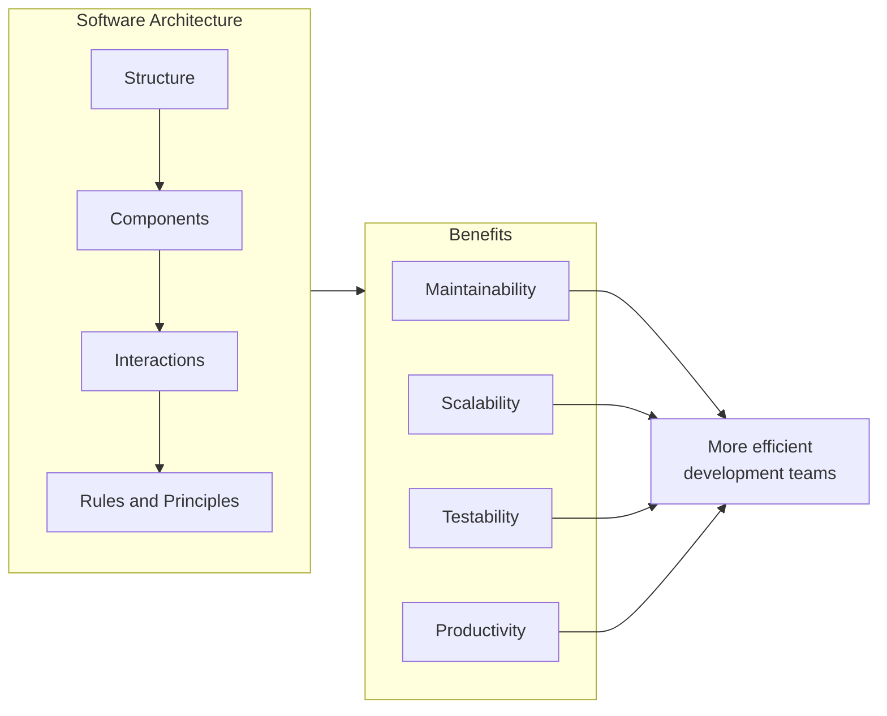

A **good architecture is fundamental to applying and maintaining a good workflow for all developers involved in the project**, as well as making it easier for new teams or members to join the project without major problems. Additionally, a correct architecture makes the codebase more maintainable, scalable, and testable. In short, **it increases software quality and development team productivity**.

### The Pillars of Good Frontend Architecture

To better understand what makes an architecture "good," let's look at its fundamental pillars:

| Pillar | Description | Practical Example |
|--------|-------------|-------------------|
| **Separation of concerns** | Each module has a single responsibility | UI components separated from business logic |
| **Low coupling** | Modules depend as little as possible on each other | Using interfaces and abstractions |
| **High cohesion** | Related elements are grouped together | Well-defined features or domains |
| **Scalability** | The system can grow without major restructuring | Modular architecture |
| **Testability** | Ease of writing and running tests | Injectable dependencies |


## On the Other Side of the River: Architecture Anti-Patterns

After the brief explanation about applying good architecture in Frontend, it's important to make a contrast with architecture anti-patterns.

> An **anti-pattern** is a common response to a recurring problem that is usually ineffective and risks being highly counterproductive. — *AntiPatterns: Refactoring Software, Architectures, and Projects in Crisis*

To better understand the concept, we'll apply a hypothesis with its respective counter-hypothesis:

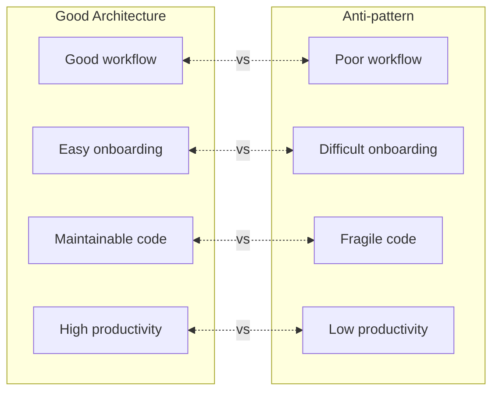

- **Hypothesis**: "Good architecture maintains a good workflow for the entire development team."
- **Counter-hypothesis**: "An architecture anti-pattern can generate a poor workflow for the entire development team."

- **Hypothesis**: "Good architecture facilitates the incorporation of new members into the development team."
- **Counter-hypothesis**: "An architecture anti-pattern can hinder the incorporation of new members into the development team."

- **Hypothesis**: "Good architecture makes the codebase more maintainable, scalable, and testable."
- **Counter-hypothesis**: "An architecture anti-pattern can make the codebase less maintainable, scalable, and testable."

- **Hypothesis**: "Good architecture increases software quality and development team productivity."
- **Counter-hypothesis**: "An architecture anti-pattern can decrease software quality and development team productivity."

Honestly, the first time I considered these points, I was surprised by how bad the counter-hypotheses sound. However, it's important to keep in mind that **architecture anti-patterns can appear in any project without us realizing it**. That's why it's important to be alert to certain points that can diagnose whether we're applying an architecture anti-pattern in Frontend.

## Are You Applying an Architecture Anti-Pattern in Frontend?

Architecture anti-patterns are not something that is applied intentionally; however, no project is exempt from them. Below, we'll look at the most common anti-patterns in Frontend development and how to identify them:

### 1. "Spaghetti Code" or the Big Ball of Mud

This is probably the most common and dangerous anti-pattern. It's characterized by a total lack of visible structure, where code grows organically and disorderly.

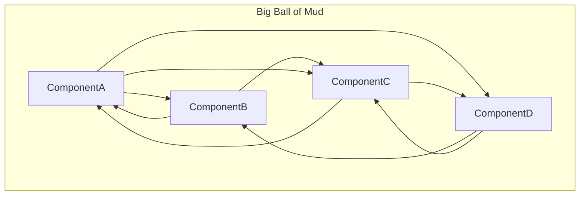

**Symptoms:**
- No clear separation of layers exists
- Components with multiple responsibilities (more than 500 lines)
- Circular dependencies between modules
- Difficulty finding where the logic for a feature is located
- Changes in one place break functionality in other places

**Solution:**

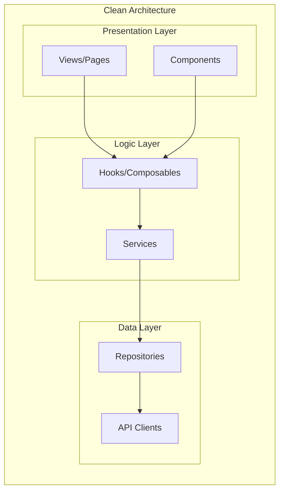

### 2. The God Component

A component that does too many things: manages state, makes API calls, contains business logic, and renders complex UI.


**Example of a God Component (Bad):**

```jsx
// UserDashboard.jsx - 800+ lines
function UserDashboard() {
  const [user, setUser] = useState(null);
  const [orders, setOrders] = useState([]);
  const [notifications, setNotifications] = useState([]);
  const [settings, setSettings] = useState({});
  const [isLoading, setIsLoading] = useState(true);
  // ... 50 more states
  
  useEffect(() => {
    // Fetch user, orders, notifications, settings...
    // Data transformation logic
    // Error handling
    // WebSocket connections
  }, [/* many dependencies */]);
  
  const handleUpdateProfile = async () => { /* ... */ };
  const handleDeleteOrder = async () => { /* ... */ };
  const handleMarkNotificationRead = async () => { /* ... */ };
  // ... 30 more handlers
  
  return (
    // 500+ lines of JSX
  );
}
```

**Solution - Composition and separation:**

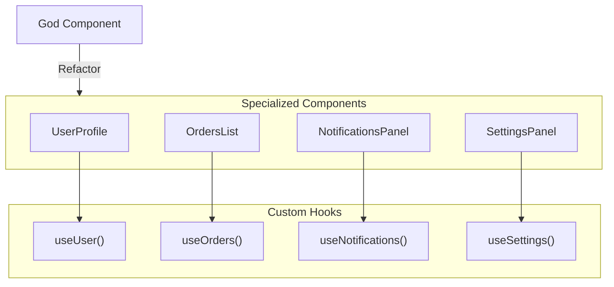

### 3. Tight Coupling

When components or modules depend too much on the internal implementation of others, any change becomes a nightmare.

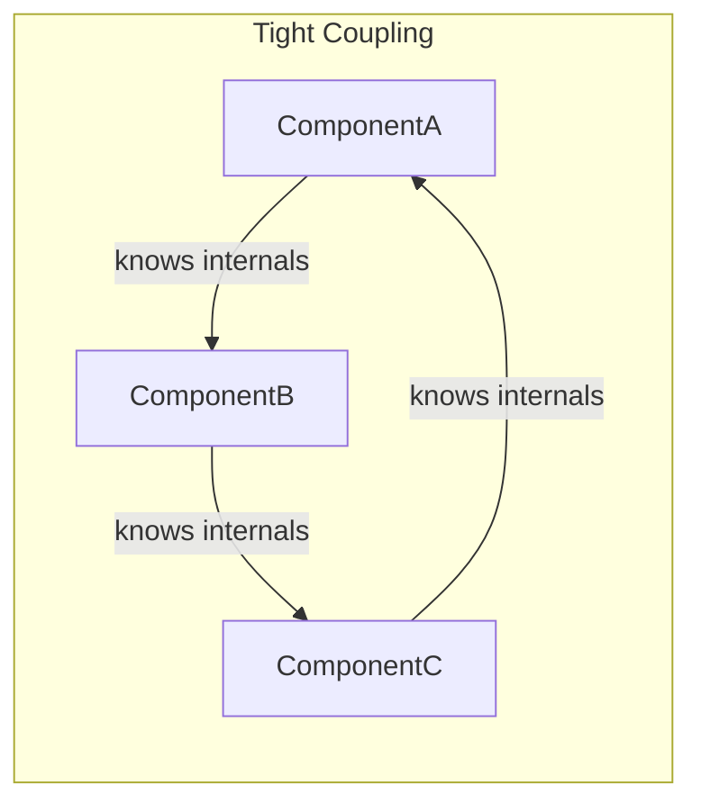

**Symptoms:**
- Changing one component requires modifying many others
- Tests require mocking many dependencies
- Components import directly from deep paths of other modules
- Excessive props drilling (passing props through 5+ levels)

**Solution - Dependency Inversion:**

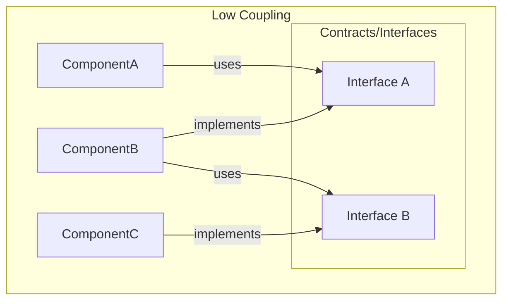

### 4. The Infinite "Utils" or "Helpers" Folder

A folder that becomes the junk drawer where everything we "don't know where to put" goes.


**Problematic structure (Bad):**

```
src/
├── utils/
│   ├── helpers.js          # 2000 lines
│   ├── functions.js        # 1500 lines
│   ├── misc.js             # ???
│   ├── common.js           # More of the same
│   └── index.js            # Re-exports everything
```

**Solution - Domain-based organization:**

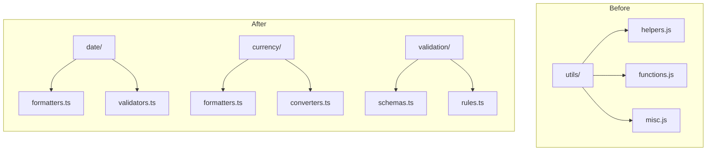

### 5. Uncontrolled Global State (Global State Soup)

Using global state for everything, even for state that should be local.

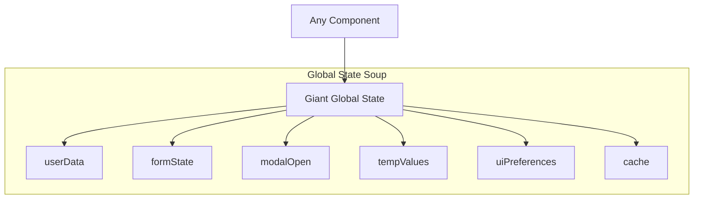

**Symptoms:**
- The global store has hundreds of properties
- Form state in Redux/Zustand
- Temporary or UI values in global state
- Difficulty tracking what modifies what
- Unnecessary re-renders throughout the application

**Solution - Separation of state responsibilities:**

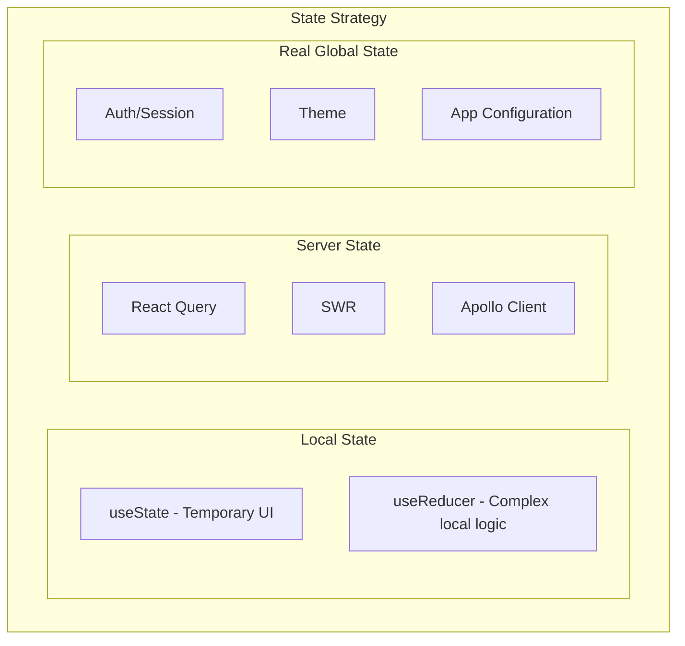

### 6. Premature Abstraction

Creating complex abstractions before they're needed, "just in case." This is a common mistake when trying to apply design patterns without a real need, often motivated by:

- Having recently read about a design pattern and wanting to apply it
- Fear of having to refactor in the future
- Pressure to write "professional" or "scalable" code
- Not distinguishing between essential complexity and accidental complexity

I must admit that I've fallen into this anti-pattern on several occasions when I still had little experience in software development. At some point in my career, I realized that with some simple questions I could avoid falling into this anti-pattern:

| Question | If the answer is NO... |
|----------|------------------------|
| Do I really need this abstraction now? | Wait until you have the real use case |
| Am I solving a real problem or a hypothetical one? | Don't solve problems that don't exist |
| Does this abstraction add value or just complexity? | Keep the solution simple |
| Can I implement this more simply first? | Do it simple and refactor later |

#### The Rule of Three

A useful principle for deciding when to abstract is the **Rule of Three**:

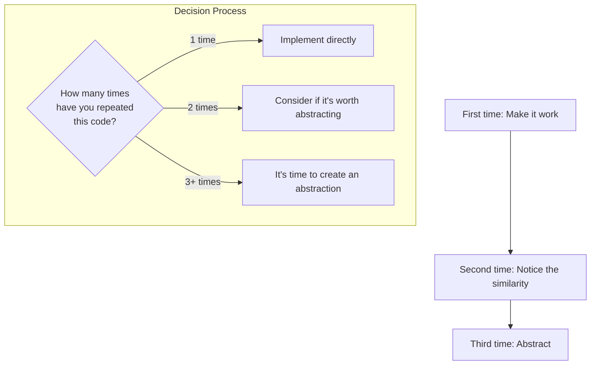

#### Example: Over-engineering vs. Pragmatic Solution

**Bad - Over-engineering for a simple button:**

```typescript
// 8 files, 200+ lines for... a button
interface IButtonStrategy {
  execute(): void;
}

interface IButtonProps {
  strategy: IButtonStrategy;
  builder: IButtonBuilder;
}

class SubmitButtonStrategy implements IButtonStrategy {
  constructor(private validator: IFormValidator) {}
  execute(): void { /* ... */ }
}

class CancelButtonStrategy implements IButtonStrategy { /* ... */ }
class ButtonStrategyFactory { /* ... */ }
class ButtonBuilder implements IButtonBuilder { /* ... */ }
class AbstractButton extends BaseComponent { /* ... */ }

// To finally render:
// <button onClick={strategy.execute}>Submit</button>
```

**Good - Simple solution that solves the real problem:**

```typescript
// One component, ~30 lines
interface ButtonProps {
  variant: 'submit' | 'cancel' | 'default';
  onClick: () => void;
  children: React.ReactNode;
  disabled?: boolean;
}

function Button({ variant, onClick, children, disabled }: ButtonProps) {
  const styles = {
    submit: 'bg-blue-500 text-white',
    cancel: 'bg-gray-200 text-gray-700',
    default: 'bg-white border border-gray-300',
  };

  return (
    <button 
      className={styles[variant]} 
      onClick={onClick}
      disabled={disabled}
    >
      {children}
    </button>
  );
}
```

#### Principles to Follow

> "Make it work, make it right, make it fast" — Kent Beck

> "Duplication is far cheaper than the wrong abstraction" — Sandi Metz

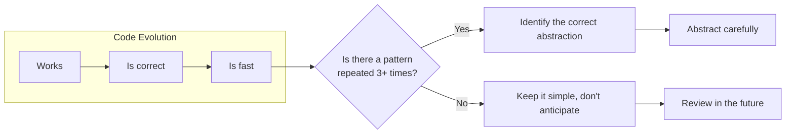

The key is finding the balance: **neither over-engineering nor mindless duplicate code**. The correct abstraction emerges when you have enough context about the real problem.

### 7. Copy-Paste Driven Development

Copying and pasting code instead of creating reusable abstractions when they ARE necessary.

**Symptoms:**
- Multiple components with nearly identical code
- Changes that require modifying many files
- Bugs that get fixed in one place but persist in others

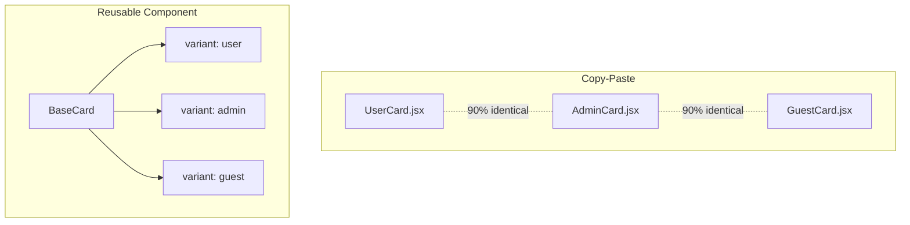

## Diagnostic Checklist

Use this checklist to evaluate your project:

| Question | Good | Problem |
|----------|------|---------|
| Can a new developer understand the structure in < 1 hour? | Yes | No |
| Can you add a feature without modifying existing code? | Yes | No |
| Do components have < 200 lines of code? | Most | Few |
| Does architecture documentation exist? | Yes | No |
| Are tests easy to write? | Yes | No |
| Does global state have < 20 properties? | Yes | No |
| Do utils folders have < 10 files? | Yes | No |

## The Path to Better Architecture

If you identified several of these anti-patterns in your project, don't worry. Refactoring is a gradual process.

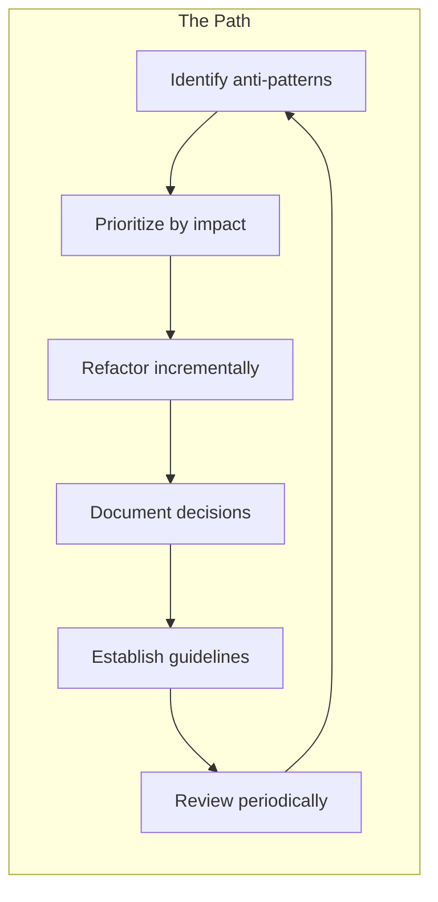

### Final Recommendations

1. **Document your architecture**: Use ADRs (Architecture Decision Records) to record the "why" behind decisions.

2. **Establish conventions**: Define a clear and consistent folder structure.

3. **Review code as a team**: Code reviews help detect anti-patterns early.

4. **Measure and monitor**: Use tools like SonarQube, ESLint with complexity rules, and coverage metrics.

5. **Learn from others**: Study proven architectures like Feature-Sliced Design, Atomic Design, or Clean Architecture adapted to Frontend.

## Conclusion

Architecture anti-patterns are like silent technical debt: we don't notice them until the project becomes difficult to maintain. The key is:

- **Detect early**: Regularly review the health of your code
- **Learn continuously**: Study architecture patterns
- **Communicate with the team**: Architecture decisions are team decisions
- **Balance**: Neither over-engineering nor spaghetti code

Have you identified any of these anti-patterns in your projects? Share your experience in the comments!

---

**References:**

- *Clean Architecture* - Robert C. Martin
- *Patterns of Enterprise Application Architecture* - Martin Fowler
- *AntiPatterns: Refactoring Software, Architectures, and Projects in Crisis* - Brown et al.

---

*Did you like this article? Follow me for more content about Frontend architecture and development best practices.*
