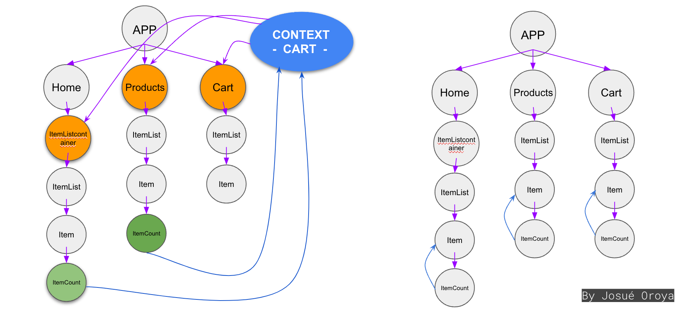

# Simplicidad: la fortaleza y debilidad de Zustand

Estás usando Zustand como tu gestor de estado y sientes que cada vez se vuelve más complicado de mantener. ¿Por qué? Porque estás mezclando la gestión de datos con el flujo de estado. En este artículo, te mostraré cómo separar ambos conceptos para que tu código sea más fácil de mantener y puedas crear interfaces de usuario más complejas sin volverte loco.

Durante los últimos años, he estado trabajando con interfaces de usuario complejas que requieren la aplicación de patrones de diseño avanzados. He probado muchas bibliotecas de gestión de estado en React, como por ejemplo Redux o Context API entre otras. Sin embargo, desde hace poco Zustand se ha convertido en el engreído de la comunidad de React. Esto se debe a que es muy fácil de usar y tiene un rendimiento excelente. Obviamente, no es perfecto, pero es una excelente opción para la mayoría de los casos.

Vamos a introducirnos un poco en el concepto de "State Management" y cómo a partir de él podemos separar la **gestión de datos** del **flujo de estado**.

## ¿Qué es la gestión de estado?

Como desarrolladores de interfaces de usuario, estamos acostumbrados a trabajar con el concepto de estado. En React, el estado es una variable que se utiliza para almacenar datos que pueden cambiar a lo largo del tiempo. Por ejemplo, si tienes un contador, el estado sería el número actual que se muestra en la pantalla. Cuando el usuario hace clic en el botón de incremento, el estado cambia y el número se actualiza (un ejemplo muy cliché, lo sé). Los estados son fundamentales en React porque permiten que los componentes sean reactivos, es decir, que se actualicen automáticamente cuando cambian los datos.

Los estados, como cualquier otro dato declarado dentro de un componente, se pierden cuando el componente se desmonta o son inaccesibles desde otros componentes de más alto nivel. Además, los estados pueden cambiar de forma asincrónica, lo que puede llevar a errores difíciles de depurar. Por estas razones y por muchas otras más, es necesario utilizar una biblioteca de gestión de estado para manejar los datos de forma global y centralizada.

Pongamos un ejemplo con Context API:

Como podemos apreciar en la imagen, las flechas de color moradas representan la propagación de datos a través de los componentes. Aquellos componentes que se encuentran en un nivel o una capa superios pueden pasar datos a los componentes de niveles inferiores. Sin embargo, esta propagación de datos puede volverse un dolor de cabeza cuando la aplicación crece y se vuelve más compleja, ya que cualquier modificación en la composición de los componentes puede afectar la propagación de datos y, por ende, la lógica de la aplicación.

Es por eso que aplicar técnicas de gestión de estado es fundamental para mantener la coherencia. En este caso, Context API nos permite crear un contexto global que puede ser consumido por cualquier componente de la aplicación. De esta forma, podemos centralizar la lógica de la aplicación y evitar la propagación de datos a través de los componentes.

En el caso de Zustand, la gestión de estado se realiza a través de **stores**. Un store es un objeto que contiene los datos de la aplicación y los métodos para modificarlos. Por ejemplo, si tenemos un contador, el store sería un objeto con una propiedad `count` y un método `increment` que incrementa el contador. Los stores se pueden compartir entre componentes y se actualizan automáticamente cuando cambian los datos.

## Zustand como gestor de estado

Como mencioné anteriormente, Zustand se ha vuelto mi biblioteca favorita para la gestión de estado en React. Su sintaxis es muy sencilla y su rendimiento es excelente. Además, es muy fácil de integrar con otras bibliotecas como React Query o React Router. 

¿Cuál es el secreto de Zustand? La verdad es que una store de Zustand no es más ni menos que un simple objeto de JavaScript. No hay magia detrás de las stores de Zustand, simplemente son objetos que contienen datos y métodos para modificarlos. Sin embargo, la simplicidad de Zustand es su mayor fortaleza y debilidad al mismo tiempo. Vamos a ver por qué.

