# FlutterでWebアプリを作るのが悪いアイデアである理由

## はじめに

Flutterはクロスプラットフォームのモバイルアプリ開発において優れたツールとして確立されています。しかし、Web開発に関しては話が異なります。本記事では、Flutter Webでの直接的な開発経験と、本番環境のWebプロジェクトには**最適な選択肢ではない**と考える技術的根拠を共有します。

## ケーススタディの背景

以前、Flutterで開発されたWebプロジェクトを引き継ぎました。勤怠管理とプロジェクト管理のための内部管理アプリケーションでした。Flutterでのモバイルプロジェクトを成功裏に完了した直後だったため、期待は高かったのですが、現実は大きく異なりました。

プロジェクトは2週間で完了する予定でしたが、結果的に**3ヶ月以上**の開発期間を要しました。同時並行で、Angular PWAを使用して同様のシステムを開発しましたが、こちらは1ヶ月以内に完了し、2ヶ月以内に優れた結果で本番環境にデプロイできました。

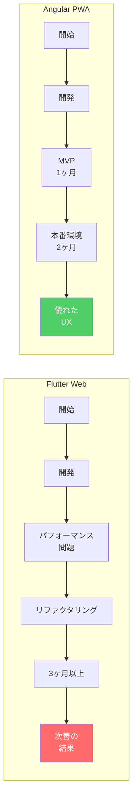

## アーキテクチャ：根本的な問題

FlutterがWebに適していない理由を理解するために、レンダリングアーキテクチャを分析する必要があります：

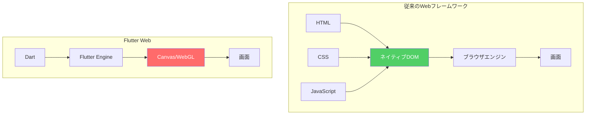

Flutterは**すべて**をCanvasに描画し、ブラウザのDOMを完全に無視します。これは以下を意味します：

- 検査できるネイティブHTML要素がない
- ブラウザの開発者ツールが役に立たない
- アクセシビリティを手動で実装する必要がある
- SEOがほぼ存在しない

## 特定された技術的問題

以下、発見した具体的な問題を詳述します：

### 1. 遅いワークフロー（Hot Reloadの欠陥）

モバイルでのFlutterの最大の強みの一つはHot Reloadですが、Webではこの機能は**著しく制限されています**。Fast RefreshのReactやLive ReloadのAngularとは異なり、Flutter Webは数秒かかる頻繁な再コンパイルが必要です。

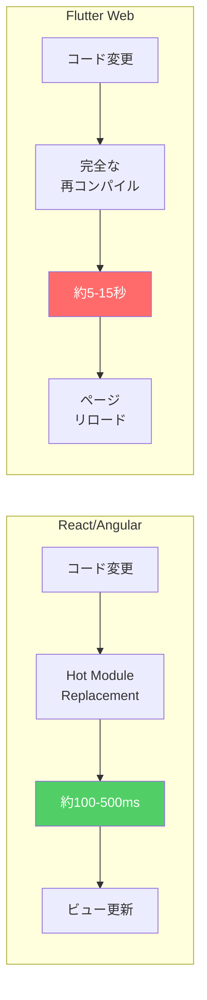

**実際の影響**：単純な色やテキストの変更でも最大15秒待つ必要があります。何百もの小さな変更がある一日の作業で、これは**何時間もの時間の損失**を意味します。

### 2. ナビゲーションのパフォーマンス低下

Flutter製のWebアプリケーションは、特にビュー間のナビゲーションで重大なパフォーマンス問題を抱えています。

**技術的な理由：**
- FlutterはWeb方式（ルートの置き換え）ではなく、**モバイルナビゲーションモデル**（画面のスタック）を使用
- レンダリングエンジンは各遷移でウィジェットツリー全体を処理する必要がある
- DOM用のブラウザのネイティブ最適化を活用できない

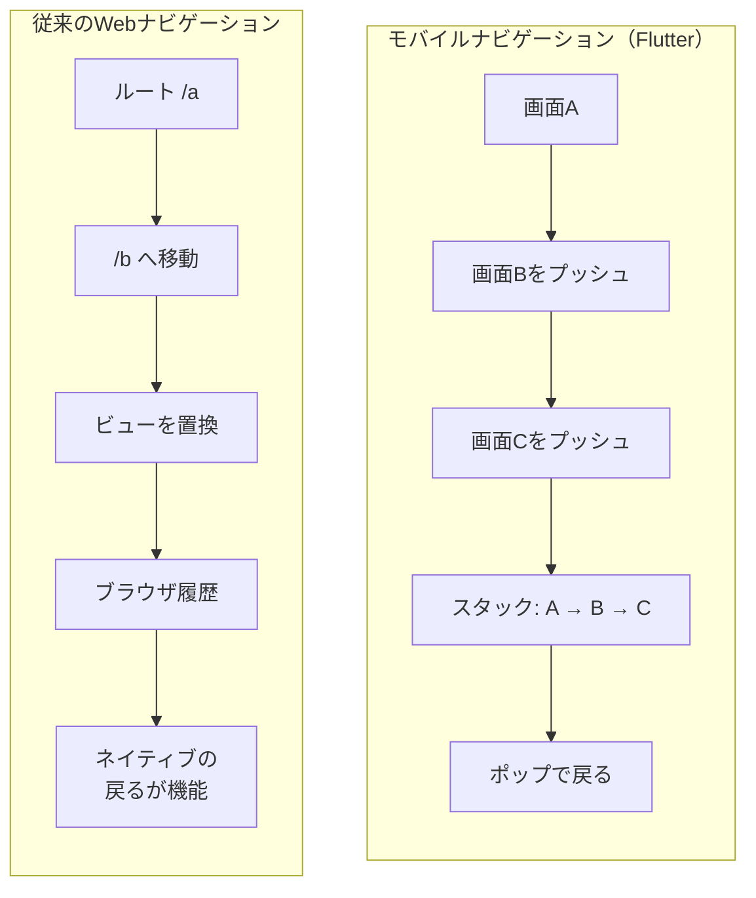

### 3. アクセシビリティの問題

これは倫理的・法的観点から**最も重大な問題**かもしれません。Webアクセシビリティ（a11y）は多くの国や分野で必須です。

**具体的な問題：**
- **スクリーンリーダー**：FlutterのCanvasをセマンティック要素として解釈できない
- **キーボードナビゲーション**：ネイティブサポートなしで手動実装が必要
- **ARIA属性**：適用するHTML要素が存在しない
- **WCAGコンプライアンス**：達成が極めて困難

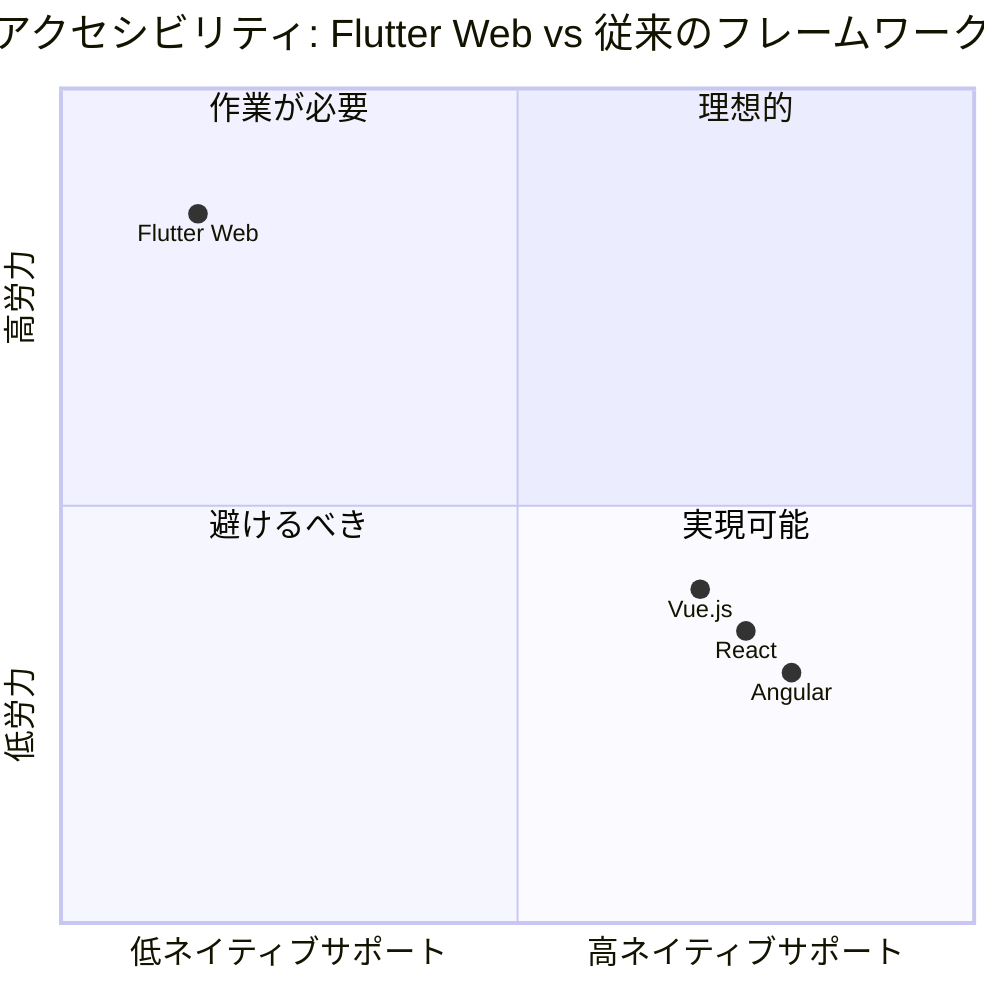

> ⚠️ **法的警告**：EU（Webアクセシビリティ指令）、米国（ADA）、その他の国々では、アクセシビリティの欠如は訴訟や多額の罰金につながる可能性があります。

### 4. 過大なバンドルサイズ

初期読み込みサイズはユーザー体験とSEOにとって重要な要素です。Flutter Webはこの点で構造的な問題を抱えています。

| フレームワーク | 典型的な初期バンドル | 読み込み時間（3G） |
|-----------|----------------------|---------------------|
| **Flutter Web** | 2-4 MB | 8-15秒 |
| React（最適化済み） | 100-300 KB | 1-3秒 |
| Angular（最適化済み） | 150-400 KB | 1-4秒 |
| Vue.js | 80-200 KB | 0.5-2秒 |

**なぜこうなるのか？**
- FlutterはWebAssemblyにコンパイルされたSkiaレンダリングエンジン全体を含む
- フォントをパッケージ化する必要がある（システムフォントを使用しない）
- フレームワークの効果的なツリーシェイキングがない
- JavaScriptにコンパイルされたDartコードは冗長

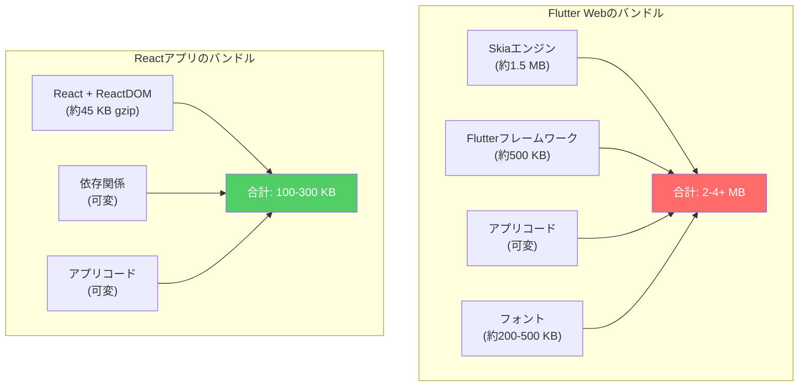

### 5. デバッグ：Canvasの地獄

私たちが知り、愛用しているWeb開発ツール（Chrome DevTools、Firefox Developer Tools）は、Flutter Webでは**事実上役に立ちません**。

**失うもの：**
- ❌ DOMの検査
- ❌ リアルタイムでのスタイル変更
- ❌ デバッグ用の効果的なネットワークスロットリング
- ❌ コンポーネントデバッグ用のコンソール
- ❌ ブラウザネイティブのパフォーマンスプロファイリング

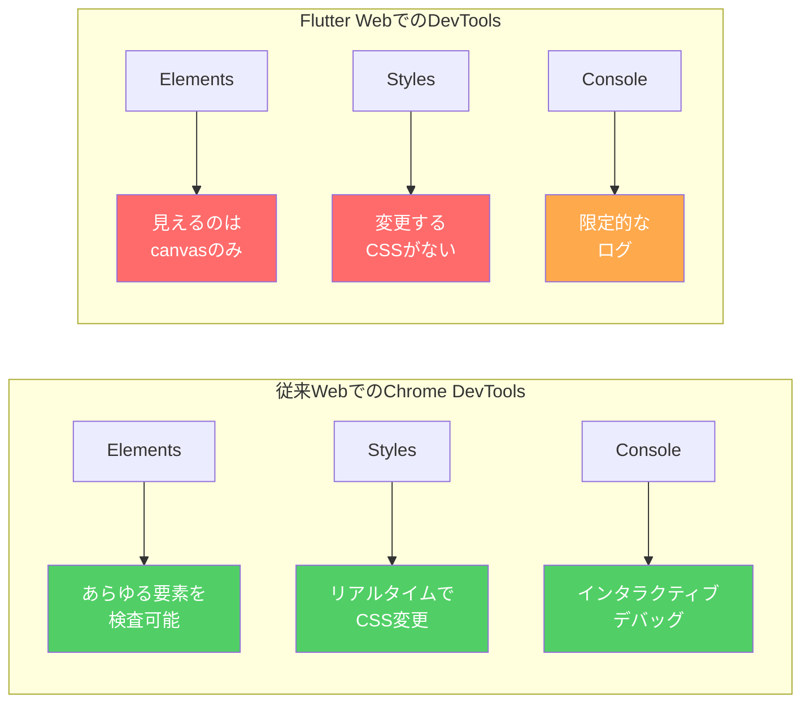

> 💡 **注意**：Flutter独自のDevToolsがありますが、フロントエンド開発者が知っているネイティブWebデバッグ体験の代わりにはなりません。

### 6. 限定的なコンポーネントエコシステム

従来のWebフレームワークには、本番環境向けの成熟したUIコンポーネントエコシステムがあります：

| フレームワーク | コンポーネントライブラリ |
|-----------|-------------------------|
| **React** | Material UI、Ant Design、Chakra UI、Radix、shadcn/ui |
| **Angular** | Angular Material、PrimeNG、NGX-Bootstrap |
| **Vue.js** | Vuetify、Quasar、Element Plus、PrimeVue |
| **Flutter Web** | Material（モバイルから移植）、限定的なWeb優先オプション |

**問題点**：Flutterのコンポーネントはモバイルを念頭に設計されています。以下のような要素：
- 横スクロールのテーブル（レスポンシブWebテーブルではない）
- ビューポートを尊重しないドロップダウン
- デスクトップでモバイルUXの日付ピッカー
- ブラウザのオートコンプリートなしのフォーム

### 7. レスポンシブ対応：車輪の再発明

従来のWebでは、長年の進化で実証されたツールがあります：

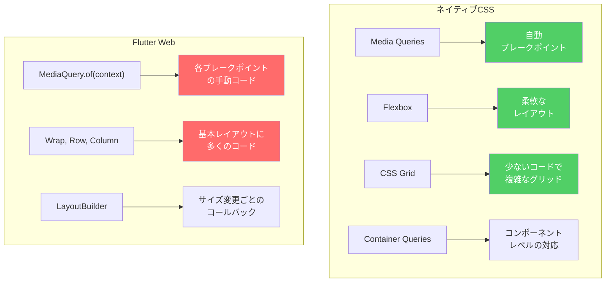

**シンプルなレスポンシブレイアウトのコード比較：**

```css
/* CSS - 3行 */
.container {
  display: grid;
  grid-template-columns: repeat(auto-fit, minmax(300px, 1fr));
  gap: 1rem;
}
```

対してFlutterは、LayoutBuilder、条件分岐、ネストされたウィジェットでかなり多くのコードが必要です。

### 8. 極端なモバイルファーストの哲学

Flutterは**モバイルファースト**の考え方で設計されており、フレームワークのあらゆる側面に反映されています：

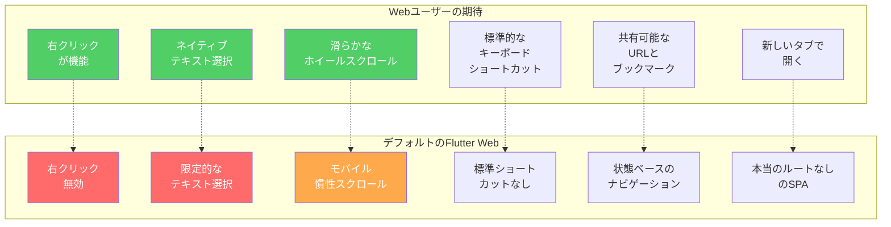

## Flutter Webを検討できるケース

公平を期すため、Flutter Webが意味を持つ非常に特定のシナリオがあります：

1. 既存のモバイルアプリのWebデモ用の**ラピッドプロトタイピング**
2. SEOや厳格なアクセシビリティ要件のない**内部アプリケーション**
3. Canvasが本当に必要な**ゲームや可視化**
4. Web開発の専門知識がない**100% Flutterチーム**

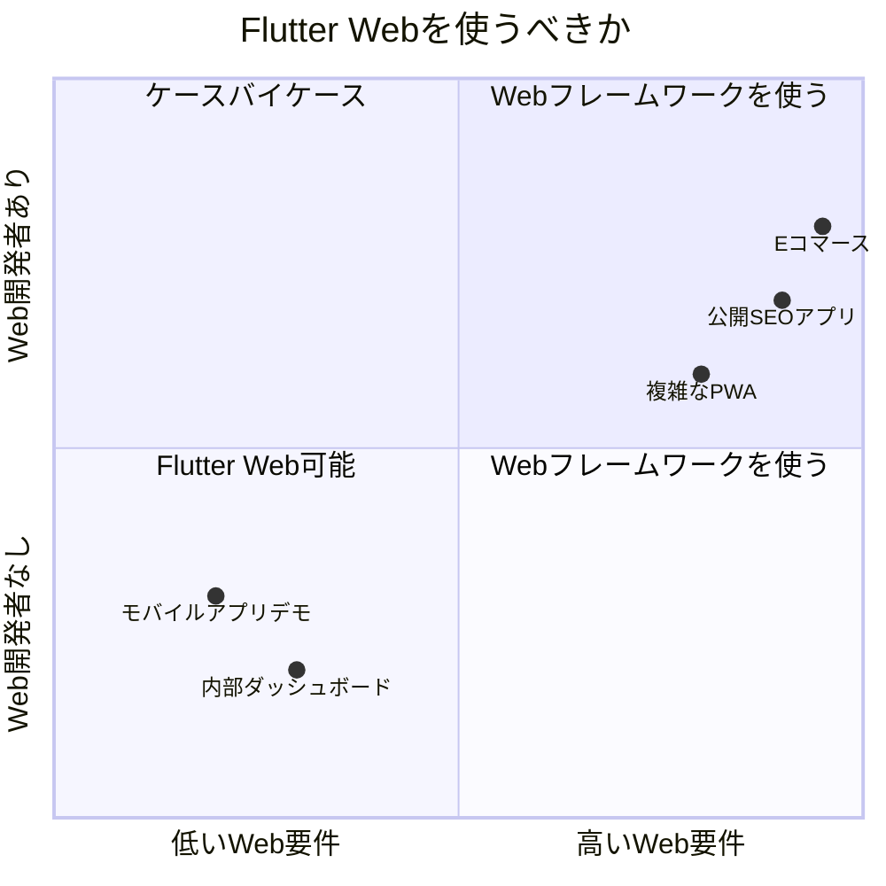

## 結論と推奨事項

直接的な経験と提示した技術的議論に基づき、ほとんどの場合、**本番環境のWeb開発にFlutterはお勧めしません**。

### 重大な問題の要約：

| 側面 | 影響 | 深刻度 |
|---------|---------|-----------|
| パフォーマンス | UX低下、ユーザーの不満 | 🔴 高 |
| アクセシビリティ | 法的リスク、ユーザー排除 | 🔴 重大 |
| バンドルサイズ | SEO影響、遅い読み込み | 🔴 高 |
| デバッグ | 生産性低下 | 🟠 中 |
| エコシステム | より多くのコード、より多くの時間 | 🟠 中 |
| レスポンシブ対応 | より複雑 | 🟠 中 |

### 私の推奨：

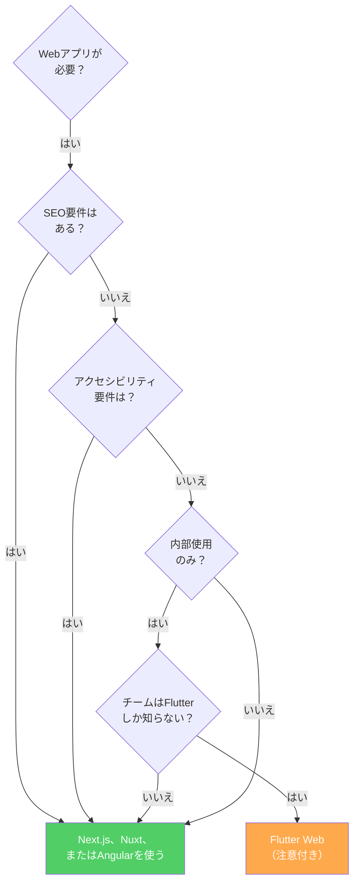

**推奨される代替案：**
- **React/Next.js**：成熟したエコシステム、優れたDX、SSR/SSG
- **Angular**：エンタープライズ対応、ネイティブTypeScript、堅牢なアーキテクチャ
- **Vue.js/Nuxt**：緩やかな学習曲線、高い生産性
- **Svelte/SvelteKit**：卓越したパフォーマンス、クリーンな構文

> 📌 **最後のメッセージ**：Flutterはモバイル開発において**卓越した**ツールです。しかし、Webに使おうとするのは、ドライバーで釘を打つようなものです：技術的には可能ですが、その作業のために特別に設計されたツールがあります。

---

*Flutter Webで同様の経験はありますか？それとも良い経験でしたか？コメントであなたの視点を聞かせてください。*
