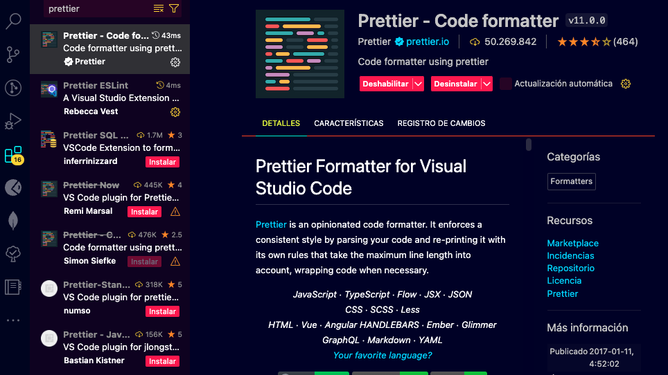
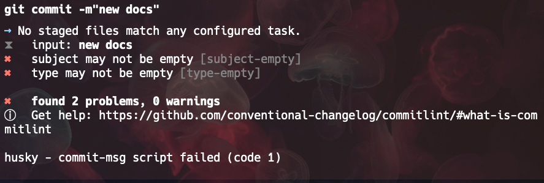

# Configurando un proyecto de React para producción

## Introducción

Internet está lleno de tutoriales sobre cómo iniciar un proyecto web con React, sin embargo la mayoría de estos tutoriales son para proyectos pequeños o de prueba. En este tutorial, aprenderás cómo las empresas reales configuran sus proyectos de React para producción utilizando las mejores prácticas.

## Requerimientos técnicos

Para seguir este artículo, necesitarás tener instalado las siguientes tecnologías:

- Node.js V20.10.0 o superior
- Git v2.43.0 o superior
- Visual Studio Code v1.94.0 o superior
- pnpm

Estas son las versiones que he utilizado para escribir este artículo, pero es posible que funcione con versiones anteriores no muy antiguas o superiores.

## ¿Por qué pnpm?

Quizás la típica frase que oirás decir a la mayoría de los desarrolladores que usamos pnpm es: "pnpm es más rápido que npm y yarn". Pero en mi experiencia trabajando en la industria, la razón más importante para usar pnpm es que este instala las dependencias de forma plana, lo que significa que no instala múltiples versiones de la misma dependencia. Esto ahorra espacio en disco y reduce el tiempo de instalación de las dependencias. Además, evita problemas de compatibilidad entre las dependencias.

## Creando un nuevo proyecto con Vite

Vite es un nuevo bundler que ha ganado mucha popularidad en la comunidad de React. Vite es mucho más rápido que Create React App y es compatible con TypeScript de forma nativa. Para crear un nuevo proyecto con Vite, simplemente ejecuta el siguiente comando:

```bash
pnpm create vite
```

Veremos las siguientes opciones:

- **Project name**: Nombre del proyecto, para este caso, el proyecto se llamará `react-real-world`.
- **Select a framework**: Selecciona React.
- **Select a variant**: Selecciona React con TypeScript.

Una vez que hayas seleccionado todas las opciones, Vite creará un nuevo proyecto de React con TypeScript.

Acto seguido, ejecuta los siguientes comandos para instalar las dependencias necesarias:

```bash
cd react-real-world
pnpm install
```

También abriremos el proyecto en Visual Studio Code:

```bash
code .
```

## React con SWC o Babel

Vite es compatible con SWC y Babel. SWC es un compilador de JavaScript extremadamente rápido que es compatible con la mayoría de las características de Babel. Sin embargo, Babel es más popular y tiene una comunidad más grande.

En lineas generales, los parámetros más importantes para elegir entre SWC y Babel son:

- **Velocidad**: SWC es mucho más rápido que Babel.
- **Compatibilidad**: Babel es más compatible con las últimas características de JavaScript.
- **Comunidad**: Babel tiene una comunidad más grande y es más popular.

Si tu aplicación será muy grande y compleja y necesitas una velocidad de compilación muy rápida en producción, te recomiendo que uses SWC. Si tu aplicación es pequeña o mediana y necesitas una compatibilidad máxima con las últimas características de JavaScript, te recomiendo que uses Babel.

En todo caso, sería mejor iniciar el proyecto con babel, osea no seleccionar SWC en la creación del proyecto, y luego cambiar a SWC si es necesario, los pasos para hacerlo son muy sencillos.

## Configurando ESLint y Prettier con TypeScript para aplicar las mejores prácticas

Ahora que hemos creado nuestro proyecto de React con TypeScript, es hora de configurar ESLint y Prettier para aplicar las mejores prácticas de codificación. Para ello justificaremos ambas herramientas cuando las estemos configurando.

Antes que nada vamos a instalar las dependencias necesarias:

```bash
pnpm install --save-dev prettier eslint eslint-plugin-react eslint-config-prettier eslint-plugin-jsx-a11y @typescript-eslint/parser @typescript-eslint/eslint-plugin
```

Pnpm instalará lo siguiente:

- **prettier**: Herramienta de formateo de código.
- **eslint**: Herramienta de análisis de código.
- **eslint-plugin-react**: Plugin de ESLint para React.
- **eslint-config-prettier**: Desactiva las reglas de ESLint que pueden entrar en conflicto con Prettier.
- **eslint-plugin-jsx-a11y**: Plugin de ESLint para accesibilidad en JSX.
- **@typescript-eslint/parser**: Parser de TypeScript para ESLint.
- **@typescript-eslint/eslint-plugin**: Plugin de ESLint para TypeScript.

> El comando `--save-dev` instala las dependencias como dependencias de desarrollo, lo que significa que no se instalarán en producción. Esto es obligatorio ya que de lo contrario las dependencias se instalarán en producción y aumentarán el tamaño de la aplicación.

### Configurando Prettier

Prettier es una herramienta de formateo de código que te permite formatear tu código automáticamente. La motivación detrás de Prettier es que no deberías perder tiempo formateando tu código manualmente, sino que deberías dejar que Prettier lo haga por ti automáticamente. De esta forma, todos los miembros del equipo de desarrollo seguirán el mismo estilo de codificación.

Para configurar Prettier, crearemos un archivo llamdo `.prettierrc.json` en la raíz del proyecto con el siguiente contenido:

```json
{
  "trailingComma": "all",
  "tabWidth": 2,
  "printWidth": 80,
  "semi": false,
  "singleQuote": true,
  "jsxSingleQuote": true
}
```

#### Configurando la extensión de Prettier en Visual Studio Code

Para que Visual Studio Code formatee automáticamente tu código con Prettier, necesitas instalar la extensión de Prettier. Para ello, abre Visual Studio Code y busca la extensión de Prettier en el Marketplace. Una vez que la hayas instalado, Visual Studio Code formateará automáticamente tu código con Prettier cada vez que guardes un archivo.



Sin embargo, es necesario configurar Visual Studio Code para que use Prettier como formateador de código por defecto. Para ello, abre el archivo de configuración de Visual Studio Code escribiendo `Ctrl + ,` si estás en Windows o `Cmd + ,` si estás en macOS o con la ruta `Archivo > Preferencias > Configuración` para Windows o `Code > Preferencias > Configuración` para macOS.

Acontinuación, selecciona la pestaña `Workspace` o `Área de trabajo` y busca la configuración `Format On Save`. Asegúrate de que la casilla esté marcada.

Por último, busca la configuración `Default Formatter` y selecciona `Prettier - Code formatter`. Esto hará que Visual Studio Code añada una carpeta `.vscode` en la raíz del proyecto con un archivo `settings.json` que contiene la configuración de Prettier para el proyecto. De esa manera el equipo de desarrollo seguirá el mismo estilo de codificación.

##### .vscode/settings.json

```json
{
  "editor.formatOnSave": true,
  "editor.defaultFormatter": "esbenp.prettier-vscode"
}
```

#### Implementando el archivo `.prettierignore`

El archivo `.prettierignore` es un archivo que le dice a Prettier qué archivos o carpetas debe ignorar al formatear el código. Por ejemplo, si tienes archivos de configuración, archivos de prueba o incluso los de distribución que no quieres formatear, puedes añadirlos al archivo `.prettierignore`.

Crea un archivo llamado `.prettierignore` en la raíz del proyecto con el siguiente contenido:

```plaintext
# Ignorar la carpeta dist
dist/

# Ignorar build
build/
```

Por cierto, la carpeta `node_modules/` está ignorada por defecto en Prettier, por lo que no es necesario añadirla al archivo `.prettierignore`.

### Configurando ESLint

Si bien Prettier se encarga de formatear el código automáticamente, ESLint se encarga de analizar el código en busca de errores y malas prácticas. ESLint es una herramienta muy potente que te permite personalizar las reglas de codificación según tus necesidades, aunque sinceramente recomiendo usar un paquete de reglas ya existente como `eslint-config-airbnb` o `eslint-config-standard` ya que son en teoría convenciones de codificación que han sido probadas y son utilizadas por la comunidad.

Por defecto a la fecha Octubre 2024, Vite en su versión 5.4.9 crea un archivo llamado `eslint.config.js` con una configuración básica de ESLint. Sin embargo, vamos a modificarlo de la siguiente manera:

```javascript
import js from "@eslint/js";
import tsEslint from "@typescript-eslint/eslint-plugin";
import tsParser from "@typescript-eslint/parser";
import prettierConfig from "eslint-config-prettier";
import jsxA11y from "eslint-plugin-jsx-a11y";
import reactHooks from "eslint-plugin-react-hooks";
import reactRefresh from "eslint-plugin-react-refresh";
import globals from "globals";

export default [
  {
    ignores: ["dist", "node_modules"], // Archivos y carpetas ignorados
    files: ["**/*.{ts,tsx,js,jsx}"], // Archivos a lint
    languageOptions: {
      ecmaVersion: "latest", // Versión de ECMAScript más reciente
      sourceType: "module", // Módulos ES
      globals: globals.browser, // Soporte para los globales del navegador
      parser: tsParser, // Parser para TypeScript
    },
    linterOptions: {
      reportUnusedDisableDirectives: true, // Detecta directivas deshabilitadas no usadas
    },
    plugins: {
      "react-hooks": reactHooks, // Plugin para React Hooks
      "react-refresh": reactRefresh, // Plugin para React Refresh
      "@typescript-eslint": tsEslint, // Plugin para TypeScript
      "jsx-a11y": jsxA11y, // Plugin para accesibilidad en JSX
    },
    rules: {
      ...js.configs.recommended.rules, // Reglas recomendadas de JavaScript
      ...tsEslint.configs.recommended.rules, // Reglas recomendadas de TypeScript
      ...reactHooks.configs.recommended.rules, // Reglas recomendadas de React Hooks
      "react-refresh/only-export-components": [
        "warn",
        { allowConstantExport: true },
      ],
      "@typescript-eslint/no-unused-vars": "warn", // Advertencia para variables no usadas en TypeScript
      "jsx-a11y/no-static-element-interactions": "warn", // Accesibilidad para interacciones de elementos estáticos
    },
  },
  prettierConfig, // Configuración de Prettier añadida directamente
];
```

La configuración propuesta es bastante sólida y sigue prácticas modernas para proyectos de React con TypeScript utilizando ESLint. Vamos a justificar algunas de las decisiones tomadas:

La configuración que propones es bastante sólida y sigue prácticas modernas para proyectos de **React con TypeScript** utilizando ESLint. Aquí te dejo un análisis de cada aspecto y algunos ajustes menores que podrían optimizarla aún más:

#### 1. **Uso de plugins**

- **React Hooks y React Refresh**: Estamos utilizando los plugins correctos para optimizar el comportamiento de React Hooks y asegurar la actualización rápida con React Refresh. Estos son esenciales para una experiencia de desarrollo rápida en entornos de React.
- **TypeScript**: Usar `@typescript-eslint/eslint-plugin` junto con `@typescript-eslint/parser` es la forma correcta de integrar TypeScript en ESLint.
- **Accesibilidad (`jsx-a11y`)**: Incluir `eslint-plugin-jsx-a11y` es una excelente práctica para asegurar que tu aplicación React siga buenas prácticas de accesibilidad.

#### 2. **Soporte para Prettier**

- Incluir `eslint-config-prettier` al final del arreglo es lo correcto. Esto asegura que las reglas de estilo y formato de Prettier no entren en conflicto con las reglas de ESLint, permitiendo que Prettier maneje el formato del código y ESLint se centre en la calidad del código.

#### 3. **Ignorar archivos**

- **`ignores: ['dist', 'node_modules']`**: Este uso de `ignores` es correcto y moderno, ya que `.eslintignore` ha sido reemplazado por la propiedad `ignores` en las configuraciones planas.

#### 4. **Configuración de reglas**

- **Recomendadas**: Se ha configurado correctamente las reglas recomendadas de JavaScript, TypeScript y React Hooks.
- **Reglas personalizadas**: Las reglas personalizadas como `'@typescript-eslint/no-unused-vars': 'warn'` están bien configuradas para evitar que las variables no usadas rompan la compilación, pero sigan mostrando advertencias. También, se añadió reglas para la accesibilidad (`'jsx-a11y/no-static-element-interactions': 'warn'`) es una excelente opción para garantizar que los componentes cumplan con los estándares de accesibilidad.

### Probando la configuración de ESLint y Prettier

Para probar la configuración de ESLint y Prettier, bastará con ejecutar el siguiente comando:

`ESLint`

```bash
pnpm eslint './src/**/*.{ts,tsx,js,jsx}' --fix
```

`Prettier`

```bash
pnpm prettier --write .
```

Si todo está configurado correctamente, ESLint y Prettier formatearán y analizarán tu código sin errores. Si hay errores, ESLint y Prettier te mostrarán mensajes de error en la consola y te indicarán cómo solucionarlos.

### Añadiendo scripts de ESLint y Prettier al `package.json`

Para facilitar el uso de ESLint y Prettier, añadiremos scripts al archivo `package.json` que nos permitirán ejecutar ESLint y Prettier con un solo comando.

```json
{
  "scripts": {
    "lint": "pnpm eslint './src/**/*.{ts,tsx,js,jsx}' --fix",
    "format": "pnpm prettier --write ."
  }
}
```

Después de añadir los scripts, ahora tenemos que asegurarnos de que estos se ejecuten antes de crear un commit que sería el paso previo a enviar el código a nuestro repositorio remoto y posteriormente a producción. Para ello, vamos a instalar la dependencia `husky` que nos permitirá ejecutar scripts antes de realizar un commit.

## Configurando Husky para ejecutar ESLint y Prettier antes de hacer un commit

Husky es una herramienta que te permite ejecutar scripts antes de realizar un commit en Git. Esto es útil para asegurarte de que tu código cumple con las reglas de ESLint y Prettier antes de enviarlo a tu repositorio remoto.

Para evitar accidentes, podemos configurar `Husky` y `lint-staged`, que se ejecutan antes de confirmar nuestro código en Git y garantizan que Prettier y ESLint se ejecuten correctamente en el código fuente antes de confirmarlo.

### Inicializar git en el proyecto

Ya que estamos usando Vite, este bundle no inicializa un repositorio git por defecto, por lo que debemos hacerlo manualmente. Para ello, ejecuta el siguiente comando:

```bash
git init
```

### Instalar Husky y lint-staged

Vamos a instalar las dependencias necesarias:

```bash
pnpm install --save-dev husky lint-staged
```

### Configurar Husky y lint-staged

Abre el archivo `package.json` y añade las siguientes configuraciones:

```json
{
  "lint-staged": {
    "*.ts": ["eslint --fix", "prettier --write"],
    "*.tsx": ["eslint --fix", "prettier --write"]
  }
}
```

Esta configuración le dice a `lint-staged` que ejecute ESLint y Prettier en los archivos `.ts` y `.tsx` antes de confirmarlos en Git.

> Nota: Como puedes ver, estamos separando los archivos `.ts` y `.tsx` para darle más flexibilidad y granularidad a la configuración. Puedes añadir más extensiones de archivos si lo necesitas. Esto nos permitirá la posibilidad de aplicar reglas específicas y diferentes para cada tipo de archivo. Sin embargo, si deseas aplicar las mismas reglas a todos los archivos, puedes usar `*.{ts,tsx}`.

#### Inicializar Husky

Para inicializar Husky, ejecuta el siguiente comando:

```bash
pnpm exec husky init
```

> Nota: el comando `pnpm exec` ejecuta un comando en el contexto de un paquete, en este caso, `husky`. Puedes consultar los comandos disponibles en la [documentación oficial de Husky](https://typicode.github.io/husky/get-started.html) si estás usando npm o yarn.

El comando anterior creará un archivo llamado `.husky/pre-commit` en la raíz del proyecto con el siguiente contenido:

```bash
pnpm test
```

Este comando ejecutará los tests antes de confirmar el código en Git. Sin embargo, vamos a modificarlo para que ejecute ESLint y Prettier en su lugar.

#### Modificar el archivo `.husky/pre-commit`

Abre el archivo `.husky/pre-commit` y modifícalo de la siguiente manera:

```bash
npx lint-staged
```

Este script ejecutará `lint-staged` antes de confirmar el código en Git. `lint-staged` ejecutará ESLint y Prettier en los archivos `.ts` y `.tsx` antes de confirmarlos.

#### Asegurarse de que Husky se instale cuando se clone el repositorio

Ya que es probable que en un proyecto real se clone el repositorio en diferentes máquinas, es importante que Husky se instale automáticamente en cada máquina. Para ello, añade el siguiente script al archivo `package.json`:

```json
{
  "scripts": {
    "prepare": "husky install"
  }
}
```

## Bonus: Configurando una convención de commits con Commitlint

Commitlint es una herramienta que te permite configurar una convención de commits en tu proyecto. Esto es útil para asegurarte de que todos los commits sigan un formato específico y sean fáciles de leer.

### Instalar Commitlint

Vamos a instalar las dependencias necesarias:

```bash
pnpm add --save-dev @commitlint/{cli,config-conventional}
```

Luego crear un archivo llamado `commitlint.config.js` en la raíz del proyecto usando el siguiente comando:

```bash
echo "export default { extends: ['@commitlint/config-conventional'] };" > commitlint.config.js
```

Esto creará un archivo `commitlint.config.js` con la configuración de Commitlint con el siguiente contenido:

```javascript
export default { extends: ["@commitlint/config-conventional"] };
```

### Configurar Husky para ejecutar Commitlint antes de hacer un commit

Ahora toca configurar Husky para que ejecute Commitlint antes de hacer un commit. Para ello, crearemos un hook llamdo `commit-msg` que se ejecutará antes de confirmar el mensaje del commit. Usaremos el siguiente comando para crear el hook:

```bash
echo "npx --no -- commitlint --edit \$1" > .husky/commit-msg
```

Este comando crear un archivo `.husky/commit-msg` en la raíz del proyecto con el siguiente contenido:

```bash
npx --no -- commitlint --edit $1
```

Este script ejecutará Commitlint antes de confirmar el mensaje del commit en Git. Commitlint comprobará que el mensaje del commit siga la convención de commits configurada en el archivo `commitlint.config.js`.

> Nota: Esta configuración está disponible para la version 9 de Husky, si estás usando una versión anterior, puedes consultar la [documentación oficial de Husky](https://typicode.github.io/husky/get-started.html) para obtener más información.

### Convención de commits

La convención de commits que estamos utilizando es la convención convencional de Angular. Esta convención es muy popular y es utilizada por muchas empresas y proyectos de código abierto. A continuación mencionaremos algunos ejemplos de commits que siguen esta convención:

- `feat`: Nueva funcionalidad.
- `fix`: Corrección de errores.
- `docs`: Cambios en la documentación.
- `style`: Cambios que no afectan el código (espacios en blanco, formato, etc.).
- `refactor`: Cambios en el código que no corrigen errores ni añaden funcionalidades.
- `perf`: Cambios en el código que mejoran el rendimiento.
- `test`: Añadir o modificar pruebas.
- `chore`: Cambios en el proceso de construcción o herramientas auxiliares y bibliotecas.
- `revert`: Revertir un commit anterior.
- `ci`: Cambios en la configuración de CI/CD.
- `build`: Cambios en la configuración de construcción.

Si intentamos hacer un commit que no siga esta convención, Commitlint nos mostrará un mensaje de error y no nos permitirá confirmar el código en Git como se muestra en la siguiente imagen:



Para corregir el error, simplemente debemos seguir la convención de commits y volver a intentar hacer el commit.

```bash
git commit -m "docs: document for the project"
```

## Conclusiones

En este artículo, hemos aprendido cómo configurar un proyecto de React para producción utilizando las mejores prácticas. Hemos configurado Prettier y ESLint para aplicar las mejores prácticas de codificación, Husky y lint-staged para ejecutar ESLint y Prettier antes de hacer un commit, y Commitlint para configurar una convención de commits en nuestro proyecto.

Espero que este artículo te haya sido útil y te haya ayudado a configurar tu proyecto de React para producción. Si tienes alguna pregunta o sugerencia, no dudes en dejar un comentario.
