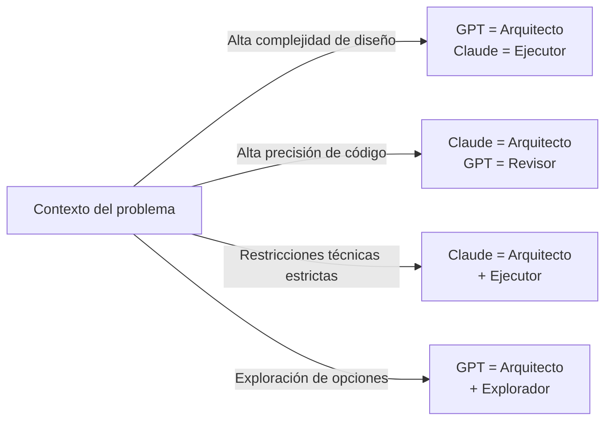
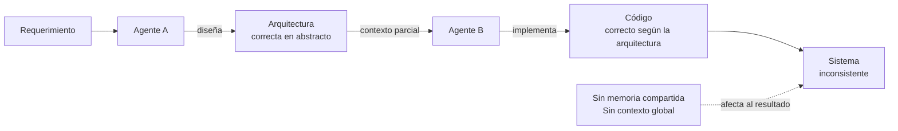
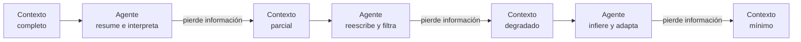
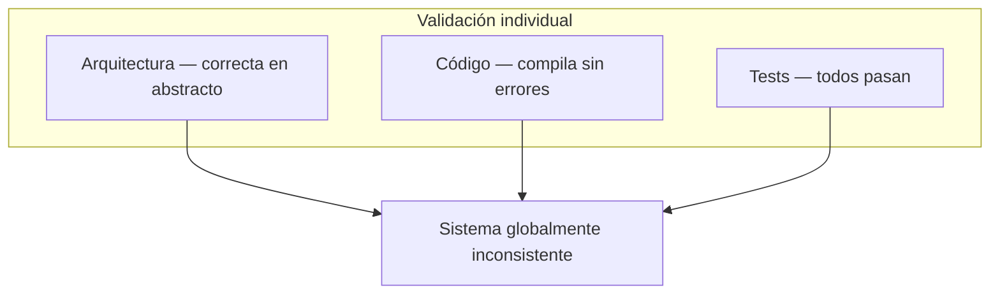
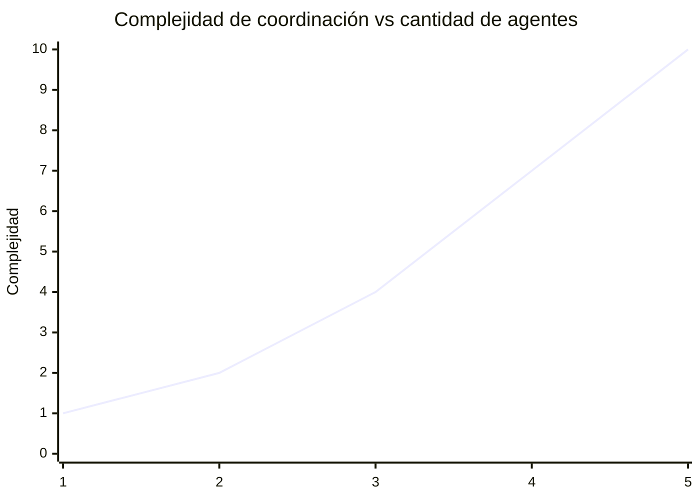
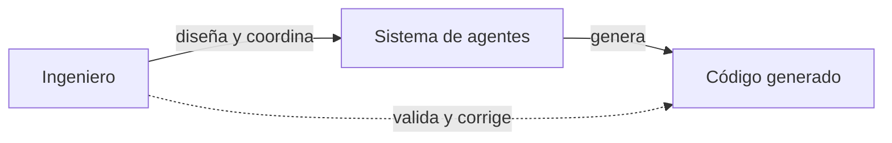

---
title: "Si Claude Sonnet es el obrero y GPT el arquitecto, ¿quién eres tú?"
emoji: "🤖"
type: "tech" # tech: 技術記事 / idea: アイデア
topics: ["ai", "llm", "software"]
published: true
---

# Si Claude Sonnet es el obrero y GPT el arquitecto, ¿quién eres tú?

Integrar más de un LLM en el proceso de desarrollo ya no es una práctica experimental. Es algo que empieza a volverse natural en equipos que realmente están empujando su productividad. Si antes éramos los arquitectos del sistema, pero ahora modelos como GPT o Claude pueden asumir ese rol, entonces la pregunta deja de ser interesante y pasa a ser necesaria: ¿qué papel jugamos nosotros?

Este artículo no busca comparar modelos ni determinar cuál es "mejor". Intentar responder eso hoy en día es perder el foco. El problema real aparece cuando dejamos de trabajar con un solo modelo y empezamos a encadenarlos. Ahí es donde todo cambia.

---

## Buenas manos, poco cerebro o viceversa

Lo que voy a contar está basado en experiencia directa trabajando con múltiples modelos dentro del mismo flujo de desarrollo. Al principio, la sensación era bastante clara: algunos modelos escribían buen código, otros proponían buenas ideas. Era fácil caer en una clasificación rápida: uno piensa, el otro ejecuta.

Durante un tiempo trabajé así. Definía una arquitectura general y luego delegaba tareas específicas a distintos agentes. Funcionaba. El output mejoraba y la velocidad también. Pero con el tiempo empezó a aparecer algo incómodo. Esa clasificación no se sostenía.

Había situaciones donde el modelo que "ejecutaba" proponía mejor arquitectura, o donde el modelo que "pensaba" generaba decisiones que no sobrevivían al código real. Y ahí entendí que el problema no estaba en los modelos, sino en cómo los estaba usando.

> El problema no estaba en los modelos. Estaba en cómo los estaba usando.

---

## El obrero y el arquitecto no son roles fijos

Una de las primeras conclusiones es que estamos intentando forzar una estructura que no existe. No hay modelos arquitecto ni modelos obrero. Hay modelos que, bajo ciertas condiciones, toman mejores decisiones o ejecutan con mayor consistencia. Pero eso cambia según el contexto, el problema, el nivel de restricción y cómo se formula la tarea.

Esto rompe una idea peligrosa: que elegir bien el modelo resuelve el problema. No lo resuelve. Lo desplaza.

> Elegir bien el modelo no resuelve el problema. Lo desplaza.

---

## El problema real: encadenar agentes

Cuando trabajas con un solo modelo, los errores son relativamente fáciles de ubicar. Sabes dónde mirar: el prompt, la respuesta, el código. Pero cuando empiezas a encadenar agentes, aparece un nuevo tipo de error.

Un modelo puede proponer una arquitectura correcta en abstracto, otro puede implementarla correctamente, y aun así el sistema puede estar mal.

Esto ocurre porque los agentes no comparten realmente estado. No tienen memoria persistente real, ni contexto completo del sistema, ni historial de decisiones. Cada uno opera sobre una versión parcial del problema. Cuando los conectas, lo que haces es transferir contexto de forma incompleta.

---

## Deriva, pérdida y fallas en cascada

A medida que el sistema evoluciona, empiezan a aparecer patrones que no son bugs tradicionales, sino degradaciones progresivas. Lo que empieza como una buena decisión se transforma con el tiempo en algo distinto, porque cada agente resume, interpreta y reescribe. En ese proceso, se pierde información.

Esto se puede describir como deriva de alineación, pérdida semántica o fallas en cascada. En la práctica, se siente así: el sistema se va desviando lentamente sin que nadie lo note, y lo más complejo es que todo sigue "funcionando".

> El sistema se va desviando lentamente sin que nadie lo note. Y todo sigue "funcionando".

---

## El falso sentido de corrección

Uno de los problemas más peligrosos de trabajar con múltiples agentes es que cada parte parece correcta. La arquitectura tiene sentido, el código compila, los tests pasan. Pero el sistema, como conjunto, empieza a romperse.

Esto pasa porque los modelos optimizan localmente, validan localmente y deciden localmente. Nadie está sosteniendo la coherencia global.

> Nadie está sosteniendo la coherencia global.

---

## ¿Quién eres tú en este nuevo paradigma?

Acá es donde cambia todo. No eres solo el que diseña ni el que implementa. Tampoco eres un simple usuario de IA. Tu rol empieza a moverse hacia otro lugar: mantener coherente un sistema donde los agentes no tienen memoria real, el contexto se degrada y las decisiones se reinterpretan constantemente.

Eres quien define qué contexto recibe cada agente, qué se delega y qué no, qué límites existen y, sobre todo, quién detecta cuándo algo que parece correcto no lo es. Y eso es más difícil que escribir código.

> Eso es más difícil que escribir código.

---

## El costo invisible de agregar agentes

Existe una idea intuitiva: más agentes producen mejores resultados. En la práctica, cada agente que agregas introduce más puntos de falla, más pérdida de información y más costo de coordinación.

Esto no significa que usar múltiples modelos sea incorrecto, sino que no es gratis. El problema deja de ser solo técnico y pasa a ser de diseño.

---

## De escribir código a diseñar sistemas de decisión

Antes, el error estaba en una función. Hoy, el error puede estar en cómo encadenaste los agentes, cómo definiste el contexto o cómo permitiste que se propaguen decisiones. El código deja de ser el centro. El sistema que genera el código pasa a ser lo importante.

Esto marca una transición clara: ya no solo escribes código, diseñas sistemas que escriben código.

---

## Una última idea

Es fácil pensar que esto nos reemplaza, pero no es lo que está pasando. Te están sacando del nivel donde el error es evidente y te están empujando a uno donde el error es invisible.

En ese nivel, no gana el que programa más rápido, gana el que mantiene la coherencia cuando todo parece funcionar.

> No gana el que programa más rápido. Gana el que mantiene la coherencia cuando todo parece funcionar.

Si el arquitecto y el obrero pueden ser intercambiables, entonces el problema nunca fue quién hace qué. El problema es quién entiende el sistema completo. Y hoy, ese sigues siendo tú... el ingeniero.

> El problema nunca fue quién hace qué. El problema es quién entiende el sistema completo.