Al iniciar un proyecto tanto en el Frontend como en el Backend, generalmente definimos muchos aspectos de nuestro software de acuerdo a los requerimientos que se nos piden. Sin embargo, con el tiempo el proyecto crece y se vuelve más complejo, y es aquí donde pueden aparecer los **anti-patrones de arquitectura**. En este artículo veremos algunos puntos que pueden diagnosticar que estamos aplicando un anti-patrón de arquitectura en el Frontend sin saberlo, y lo más importante: **cómo solucionarlos**.


## ¿Qué es y por qué es importante la arquitectura en el Frontend?

Antes que nada, me gustaría definir un poco acerca de lo que significa `arquitectura` en el desarrollo de software. Si eres nuevo en el mundo de la programación, es posible que hayas escuchado este término pero no sepas exactamente a qué se refiere.

> **Arquitectura de software** es la estructura de alto nivel de un sistema de software, la disciplina de crear tales estructuras, y la documentación de estas estructuras. — *Software Architecture in Practice, Bass et al.*

En palabras simples, una arquitectura en el desarrollo de software es la estructura que define cómo se organizarán los diferentes componentes de un sistema y cómo interactuarán entre sí. Además, la arquitectura define las reglas y los principios que guiarán el desarrollo del software.

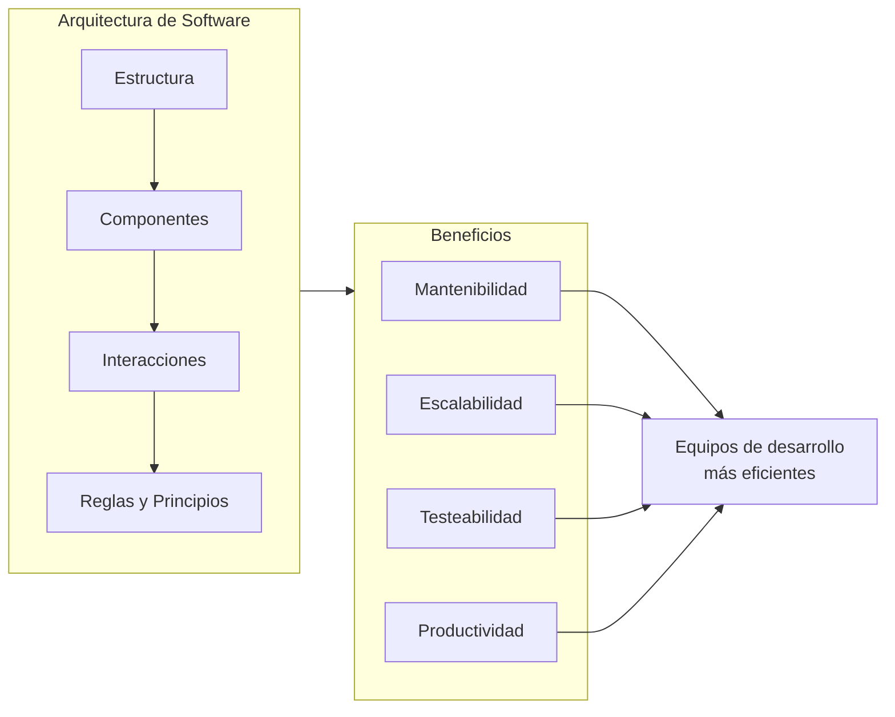

Una **buena arquitectura es fundamental para aplicar y mantener un buen flujo de trabajo para todos los desarrolladores implicados en el proyecto**, así como también facilita que nuevos equipos o miembros se sumen al proyecto sin mayores problemas. Además, una correcta arquitectura hace que la base de código sea más mantenible, escalable y testeable. En pocas palabras, **incrementa la calidad del software y la productividad de los equipos de desarrollo**.

### Los pilares de una buena arquitectura Frontend

Para entender mejor qué hace que una arquitectura sea "buena", veamos sus pilares fundamentales:

| Pilar | Descripción | Ejemplo práctico |
|-------|-------------|------------------|
| **Separación de responsabilidades** | Cada módulo tiene una única responsabilidad | Componentes UI separados de la lógica de negocio |
| **Bajo acoplamiento** | Los módulos dependen lo menos posible entre sí | Usar interfaces y abstracciones |
| **Alta cohesión** | Elementos relacionados están agrupados | Features o dominios bien definidos |
| **Escalabilidad** | El sistema puede crecer sin reestructuración mayor | Arquitectura modular |
| **Testeabilidad** | Facilidad para escribir y ejecutar tests | Dependencias inyectables |


## Del otro lado del río: los anti-patrones de arquitectura

Luego de la breve explicación acerca de aplicar una buena arquitectura en el Frontend, es importante hacer una contraposición con los anti-patrones de arquitectura.

> Un **anti-patrón** es una respuesta común a un problema recurrente que es usualmente inefectiva y tiene el riesgo de ser altamente contraproducente. — *AntiPatterns: Refactoring Software, Architectures, and Projects in Crisis*

Para entender mejor el concepto, aplicaremos una hipótesis con su respectiva contra-hipótesis:

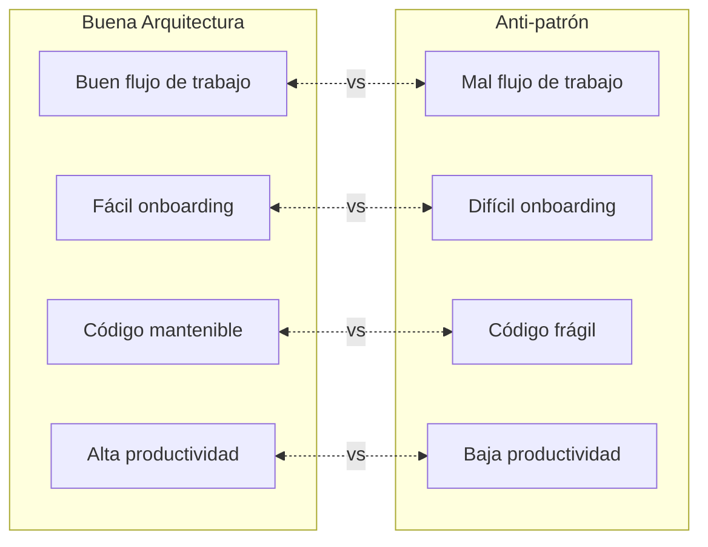

- **Hipótesis**: "Una buena arquitectura mantiene un buen flujo de trabajo para todo el equipo de desarrollo".
- **Contra-hipótesis**: "Un anti-patrón de arquitectura puede generar un mal flujo de trabajo para todo el equipo de desarrollo".

- **Hipótesis**: "Una buena arquitectura facilita la incorporación de nuevos miembros al equipo de desarrollo".
- **Contra-hipótesis**: "Un anti-patrón de arquitectura puede dificultar la incorporación de nuevos miembros al equipo de desarrollo".

- **Hipótesis**: "Una buena arquitectura hace que la base de código sea más mantenible, escalable y testeable".
- **Contra-hipótesis**: "Un anti-patrón de arquitectura puede hacer que la base de código sea menos mantenible, escalable y testeable".

- **Hipótesis**: "Una buena arquitectura incrementa la calidad del software y la productividad de los equipos de desarrollo".
- **Contra-hipótesis**: "Un anti-patrón de arquitectura puede disminuir la calidad del software y la productividad de los equipos de desarrollo".

Sinceramente, la primera vez que me planteé estos puntos, quedé sorprendido por lo mal que se oyen las contra-hipótesis. Sin embargo, es importante tener en cuenta que **los anti-patrones de arquitectura pueden aparecer en cualquier proyecto sin que nos demos cuenta**. Por eso, es importante estar atentos a ciertos puntos que pueden diagnosticar que estamos aplicando un anti-patrón de arquitectura en el Frontend.

## ¿Estás aplicando un anti-patrón de arquitectura en el Frontend?

Los anti-patrones de arquitectura no son algo que se aplique de manera intencional, sin embargo, ningún proyecto está exento de ellos. A continuación, veremos los anti-patrones más comunes en el desarrollo Frontend y cómo identificarlos:

### 1. El "Spaghetti Code" o la Gran Bola de Lodo (Big Ball of Mud)

Este es probablemente el anti-patrón más común y peligroso. Se caracteriza por una falta total de estructura visible, donde el código crece de manera orgánica y desordenada.

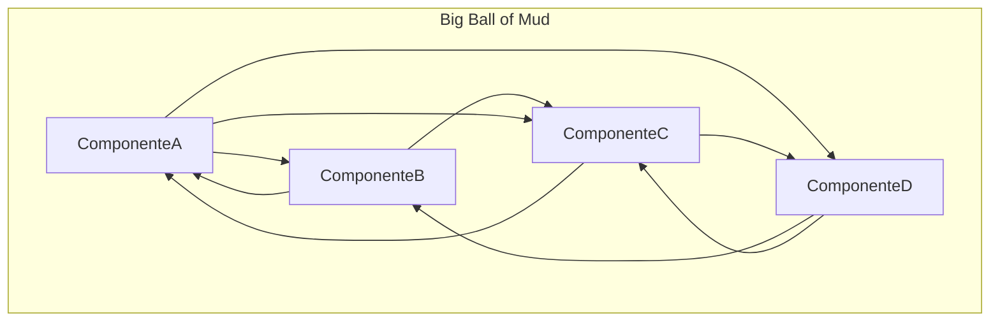

**Síntomas:**
- No existe una separación clara de capas
- Componentes con múltiples responsabilidades (más de 500 líneas)
- Dependencias circulares entre módulos
- Dificultad para encontrar dónde está la lógica de una funcionalidad
- Los cambios en un lugar rompen funcionalidades en otros lugares

**Solución:**

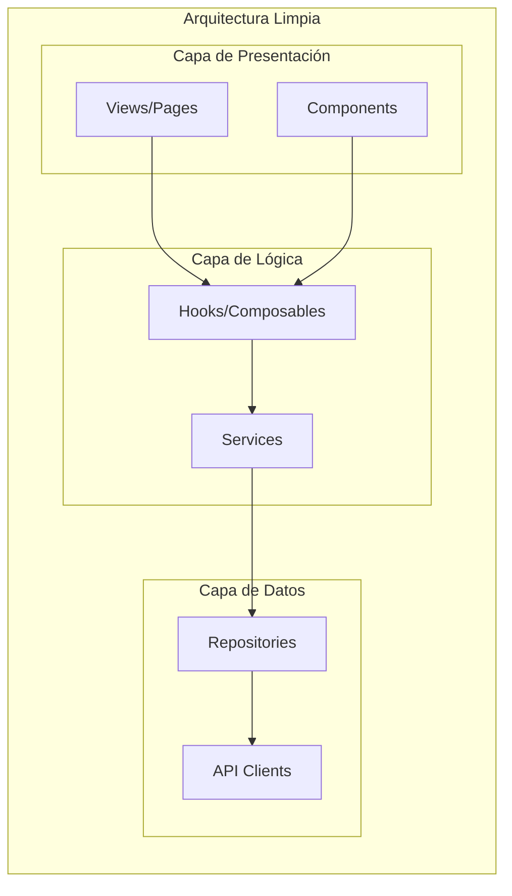

### 2. El Componente Dios (God Component)

Un componente que hace demasiadas cosas: maneja estado, hace llamadas a APIs, contiene lógica de negocio, y renderiza UI compleja.


**Ejemplo de un God Component (Mal):**

```jsx
// UserDashboard.jsx - 800+ líneas
function UserDashboard() {
  const [user, setUser] = useState(null);
  const [orders, setOrders] = useState([]);
  const [notifications, setNotifications] = useState([]);
  const [settings, setSettings] = useState({});
  const [isLoading, setIsLoading] = useState(true);
  // ... 50 más estados
  
  useEffect(() => {
    // Fetch user, orders, notifications, settings...
    // Lógica de transformación de datos
    // Manejo de errores
    // WebSocket connections
  }, [/* muchas dependencias */]);
  
  const handleUpdateProfile = async () => { /* ... */ };
  const handleDeleteOrder = async () => { /* ... */ };
  const handleMarkNotificationRead = async () => { /* ... */ };
  // ... 30 más handlers
  
  return (
    // 500+ líneas de JSX
  );
}
```

**Solución - Composición y separación:**

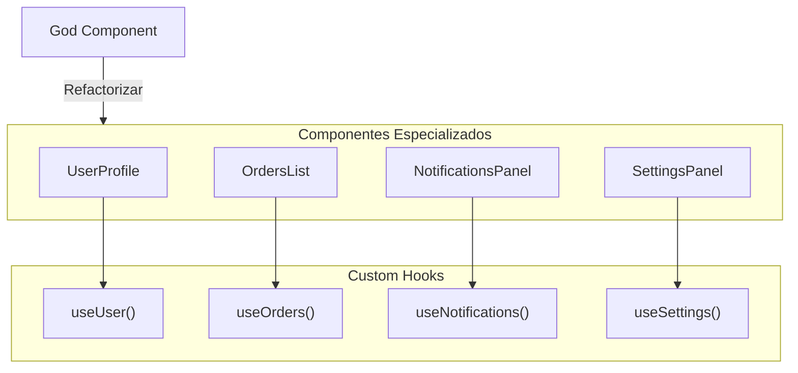

### 3. Acoplamiento Excesivo (Tight Coupling)

Cuando los componentes o módulos dependen demasiado de la implementación interna de otros, cualquier cambio se convierte en una pesadilla.

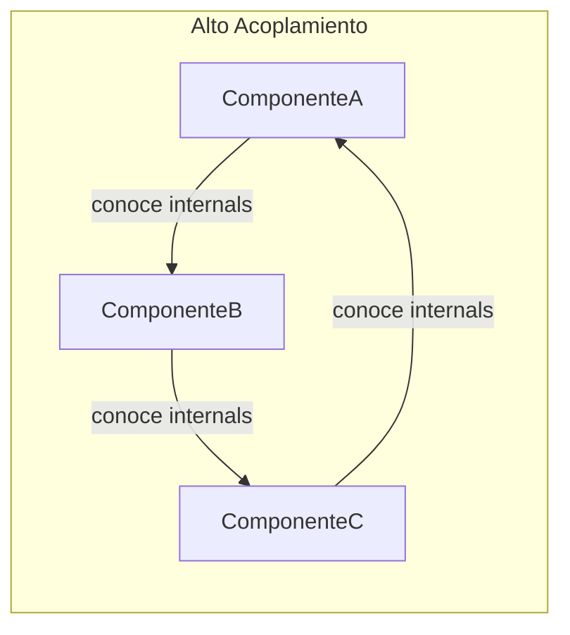

**Síntomas:**
- Cambiar un componente requiere modificar muchos otros
- Los tests requieren mockear muchas dependencias
- Componentes importan directamente de rutas profundas de otros módulos
- Props drilling excesivo (pasar props a través de 5+ niveles)

**Solución - Inversión de dependencias:**

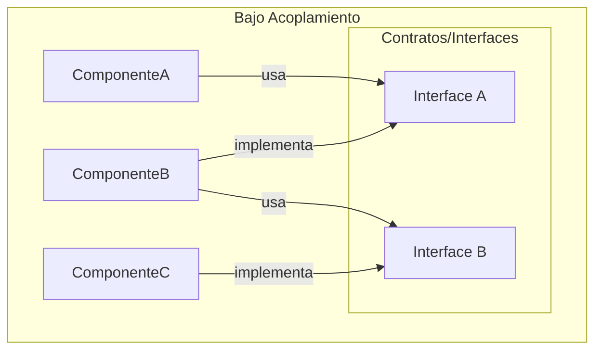

### 4. La Carpeta "Utils" o "Helpers" Infinita

Una carpeta que se convierte en el cajón de sastre donde va todo lo que "no sabemos dónde poner".


**Estructura problemática (Mal):**

```
src/
├── utils/
│   ├── helpers.js          # 2000 líneas
│   ├── functions.js        # 1500 líneas
│   ├── misc.js             # ???
│   ├── common.js           # Más de lo mismo
│   └── index.js            # Re-exporta todo
```

**Solución - Organización por dominio:**

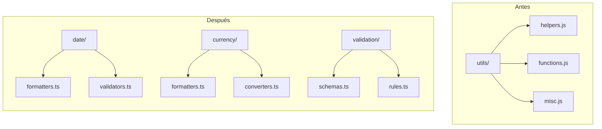

### 5. El Estado Global Descontrolado (Global State Soup)

Usar estado global para todo, incluso para estado que debería ser local.

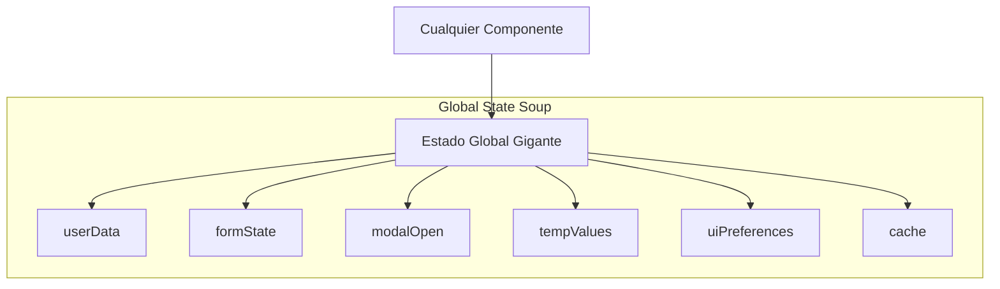

**Síntomas:**
- El store global tiene cientos de propiedades
- Estado de formularios en Redux/Zustand
- Valores temporales o de UI en estado global
- Dificultad para rastrear qué modifica qué
- Re-renders innecesarios en toda la aplicación

**Solución - Separación de responsabilidades de estado:**

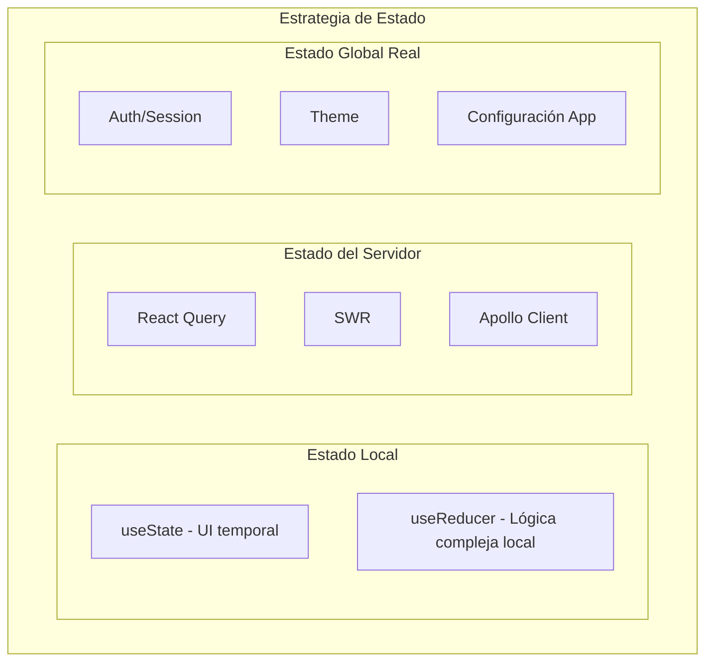

### 6. La Abstracción Prematura (Premature Abstraction)

Crear abstracciones complejas antes de que sean necesarias, "por si acaso". Este es un error común cuando se intenta aplicar patrones de diseño sin una necesidad real, muchas veces motivado por:

- Haber leído recientemente sobre un patrón de diseño y querer aplicarlo
- Miedo a tener que refactorizar en el futuro
- Presión por escribir código "profesional" o "escalable"
- No distinguir entre complejidad esencial y complejidad accidental

Debo reconocer que he caído en este anti-patrón en varias ocasiones cuando aún tenía poca experiencia en desarrollo de software. En algún momento de mi carrera, me di cuenta que con algunas preguntas simples podía evitar caer en este anti-patrón:

| Pregunta | Si la respuesta es NO... |
|----------|--------------------------|
| ¿Realmente necesito esta abstracción ahora? | Espera a tener el caso de uso real |
| ¿Estoy resolviendo un problema real o uno hipotético? | No resuelvas problemas que no existen |
| ¿Esta abstracción añade valor o solo complejidad? | Mantén la solución simple |
| ¿Puedo implementar esto de manera más simple primero? | Hazlo simple y refactoriza después |

#### La Regla del Tres

Un principio útil para decidir cuándo abstraer es la **Regla del Tres**:

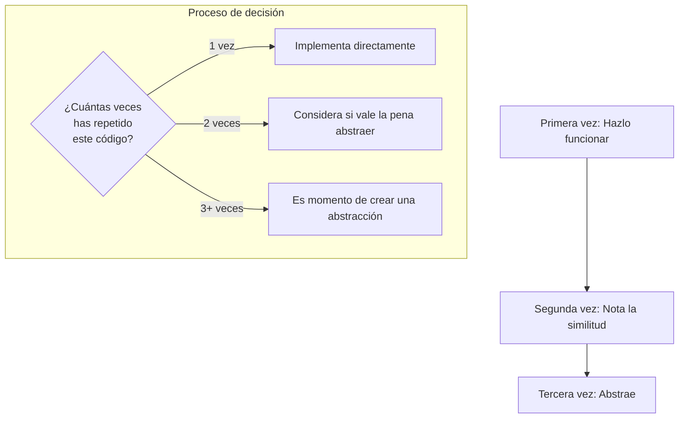

#### Ejemplo: Sobre-ingeniería vs. Solución pragmática

**Mal - Sobre-ingeniería para un simple botón:**

```typescript
// 8 archivos, 200+ líneas para... un botón
interface IButtonStrategy {
  execute(): void;
}

interface IButtonProps {
  strategy: IButtonStrategy;
  builder: IButtonBuilder;
}

class SubmitButtonStrategy implements IButtonStrategy {
  constructor(private validator: IFormValidator) {}
  execute(): void { /* ... */ }
}

class CancelButtonStrategy implements IButtonStrategy { /* ... */ }
class ButtonStrategyFactory { /* ... */ }
class ButtonBuilder implements IButtonBuilder { /* ... */ }
class AbstractButton extends BaseComponent { /* ... */ }

// Para al final renderizar:
// <button onClick={strategy.execute}>Submit</button>
```

**Bien - Solución simple que resuelve el problema real:**

```typescript
// Un componente, ~30 líneas
interface ButtonProps {
  variant: 'submit' | 'cancel' | 'default';
  onClick: () => void;
  children: React.ReactNode;
  disabled?: boolean;
}

function Button({ variant, onClick, children, disabled }: ButtonProps) {
  const styles = {
    submit: 'bg-blue-500 text-white',
    cancel: 'bg-gray-200 text-gray-700',
    default: 'bg-white border border-gray-300',
  };

  return (
    <button 
      className={styles[variant]} 
      onClick={onClick}
      disabled={disabled}
    >
      {children}
    </button>
  );
}
```

#### Principios a seguir

> "Make it work, make it right, make it fast" — Kent Beck

> "Duplication is far cheaper than the wrong abstraction" — Sandi Metz

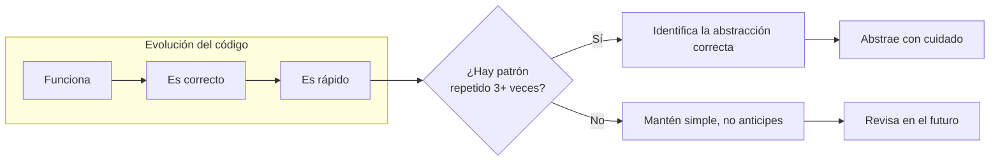

La clave está en encontrar el equilibrio: **ni sobre-ingeniería ni código duplicado sin sentido**. La abstracción correcta emerge cuando tienes suficiente contexto sobre el problema real.

### 7. El Copy-Paste Driven Development

Copiar y pegar código en lugar de crear abstracciones reutilizables cuando SÍ son necesarias. 

**Síntomas:**
- Múltiples componentes con código casi idéntico
- Cambios que requieren modificar muchos archivos
- Bugs que se arreglan en un lugar pero persisten en otros

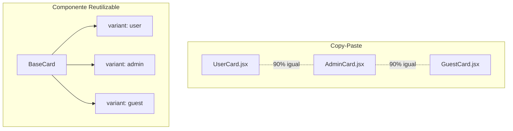

## Checklist de diagnóstico

Utiliza esta checklist para evaluar tu proyecto:

| Pregunta | Bien | Problema |
|----------|---------|-------------|
| ¿Un nuevo desarrollador puede entender la estructura en < 1 hora? | Sí | No |
| ¿Puedes añadir una feature sin modificar código existente? | Sí | No |
| ¿Los componentes tienen < 200 líneas de código? | Mayoría | Pocos |
| ¿Existe documentación de la arquitectura? | Sí | No |
| ¿Los tests son fáciles de escribir? | Sí | No |
| ¿El estado global tiene < 20 propiedades? | Sí | No |
| ¿Las carpetas utils tienen < 10 archivos? | Sí | No |

## El camino hacia una mejor arquitectura

Si identificaste varios de estos anti-patrones en tu proyecto, no te preocupes. La refactorización es un proceso gradual.

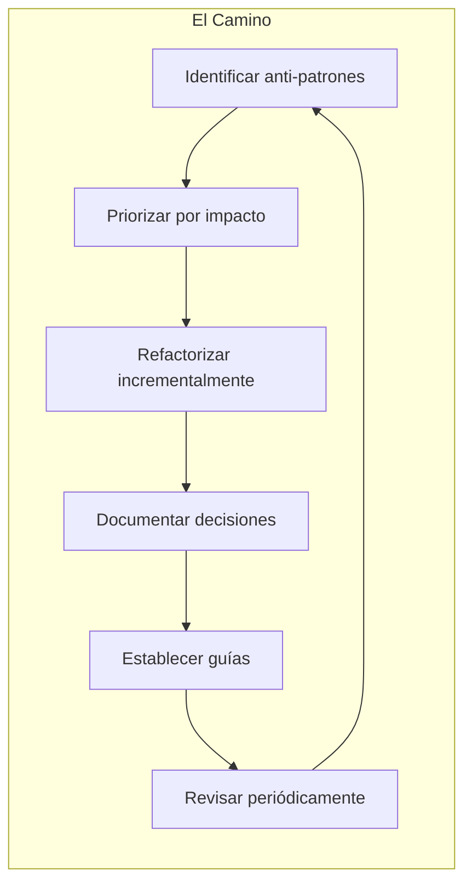

### Recomendaciones finales

1. **Documenta tu arquitectura**: Usa ADRs (Architecture Decision Records) para registrar el "por qué" de las decisiones.

2. **Establece convenciones**: Define una estructura de carpetas clara y consistente.

3. **Revisa el código en equipo**: Los code reviews ayudan a detectar anti-patrones temprano.

4. **Mide y monitorea**: Usa herramientas como SonarQube, ESLint con reglas de complejidad, y métricas de cobertura.

5. **Aprende de otros**: Estudia arquitecturas probadas como Feature-Sliced Design, Atomic Design, o Clean Architecture adaptada a Frontend.


## Conclusión

Los anti-patrones de arquitectura son como la deuda técnica silenciosa: no los notamos hasta que el proyecto se vuelve difícil de mantener. La clave está en:

- **Detectar temprano**: Revisa regularmente la salud de tu código
- **Aprender continuamente**: Estudia patrones de arquitectura
- **Comunicar con el equipo**: Las decisiones de arquitectura son decisiones de equipo
- **Balancear**: Ni sobre-ingeniería ni código espagueti

¿Has identificado alguno de estos anti-patrones en tus proyectos? ¡Comparte tu experiencia en los comentarios!

---

**Referencias:**

- *Clean Architecture* - Robert C. Martin
- *Patterns of Enterprise Application Architecture* - Martin Fowler
- *AntiPatterns: Refactoring Software, Architectures, and Projects in Crisis* - Brown et al.

---

*¿Te gustó este artículo? Sígueme para más contenido sobre arquitectura Frontend y buenas prácticas de desarrollo.* 