# Por qué crear una aplicación web con Flutter puede ser una mala idea

## Introducción

Flutter se ha consolidado como una herramienta excepcional para el desarrollo de aplicaciones móviles multiplataforma. Sin embargo, cuando se trata de desarrollo web, la historia es diferente. En este artículo, compartiré mi experiencia directa trabajando con Flutter para web y las razones técnicas fundamentadas por las cuales considero que **no es la opción más adecuada** para proyectos web de producción.

## Contexto del caso de estudio

Hace algún tiempo, heredé un proyecto web desarrollado en Flutter: una aplicación de gestión interna para carga de horas y proyectos. Venía de completar exitosamente un proyecto móvil con Flutter, por lo que tenía expectativas positivas. Sin embargo, la realidad fue muy diferente.

El proyecto estaba estimado para completarse en 2 semanas, pero terminó requiriendo **más de 3 meses** de desarrollo. En paralelo, desarrollé un sistema similar usando Angular como PWA, el cual se completó en menos de un mes y llegó a producción en menos de 2 meses con resultados superiores.

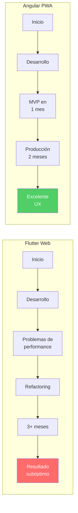

## Arquitectura: El problema fundamental

Para entender por qué Flutter no es ideal para la web, debemos analizar su arquitectura de renderizado:

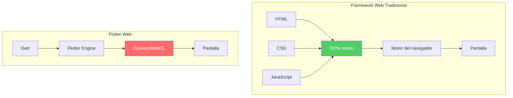

Flutter dibuja **todo** en un canvas, ignorando completamente el DOM del navegador. Esto significa que:

- No hay elementos HTML nativos que inspeccionar
- Las herramientas de desarrollo del navegador son inútiles
- La accesibilidad debe implementarse manualmente
- El SEO es prácticamente inexistente

## Problemas técnicos identificados

A continuación, detallo los problemas específicos que encontré:

### 1. Flujo de trabajo lento (Hot Reload deficiente)

Una de las mayores fortalezas de Flutter en móviles es su Hot Reload, pero en la web esta funcionalidad está **severamente limitada**. A diferencia de React con Fast Refresh o Angular con Live Reload, Flutter Web requiere recompilaciones frecuentes que pueden tomar varios segundos.

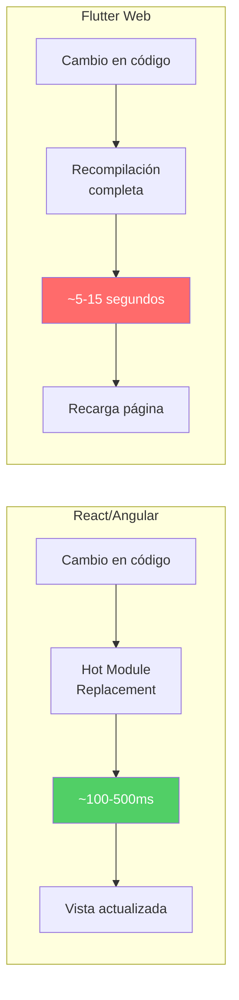

**Impacto real**: Cambiar un simple color o texto puede requerir esperar hasta 15 segundos. En un día de trabajo con cientos de cambios pequeños, esto representa **horas de tiempo perdido**.

### 2. Performance deficiente en navegación

Las aplicaciones web hechas con Flutter presentan problemas significativos de rendimiento, especialmente en la navegación entre vistas.

**Razones técnicas:**
- Flutter utiliza el **modelo de navegación móvil** (stack de pantallas) en lugar del modelo web (reemplazo de rutas)
- El motor de renderizado debe procesar todo el árbol de widgets para cada transición
- No aprovecha las optimizaciones nativas del navegador para el DOM

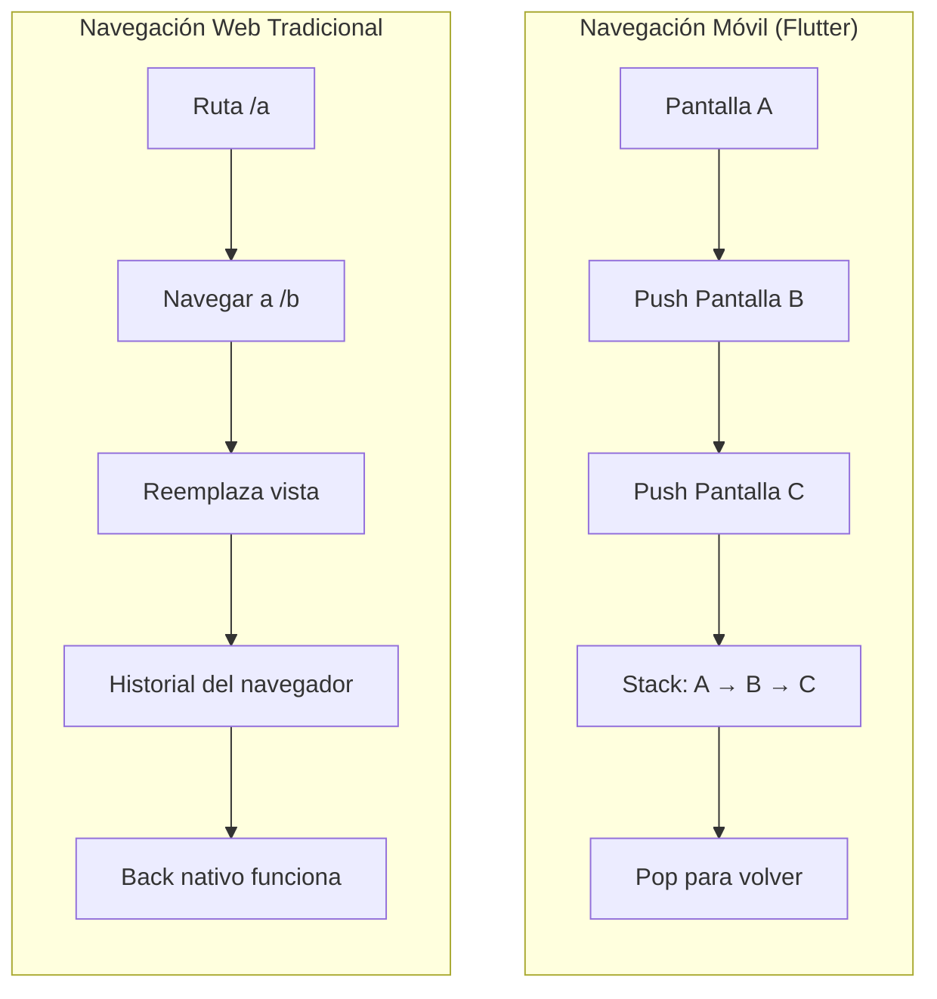

### 3. Accesibilidad comprometida  

Este es quizás el problema **más crítico** desde una perspectiva ética y legal. La accesibilidad web (a11y) no es opcional en muchos países y sectores.

**Problemas específicos:**
- **Lectores de pantalla**: No pueden interpretar el canvas de Flutter como elementos semánticos
- **Navegación por teclado**: Debe implementarse manualmente, sin soporte nativo
- **ARIA attributes**: No existen elementos HTML donde aplicarlos
- **Cumplimiento WCAG**: Extremadamente difícil de lograr

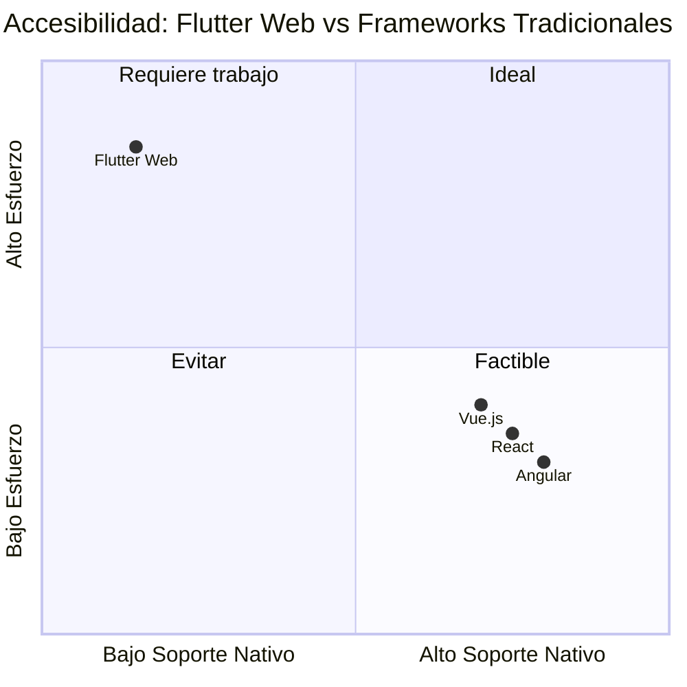

> ⚠️ **Advertencia legal**: En la Unión Europea (Directiva de Accesibilidad Web), Estados Unidos (ADA) y otros países, la falta de accesibilidad puede resultar en demandas y multas significativas.

### 4. Tamaño excesivo del bundle

El tamaño inicial de carga es un factor crítico para la experiencia del usuario y el SEO. Flutter Web tiene un problema estructural en este aspecto.

| Framework | Bundle inicial típico | Tiempo de carga (3G) |
|-----------|----------------------|---------------------|
| **Flutter Web** | 2-4 MB | 8-15 segundos |
| React (optimizado) | 100-300 KB | 1-3 segundos |
| Angular (optimizado) | 150-400 KB | 1-4 segundos |
| Vue.js | 80-200 KB | 0.5-2 segundos |

**¿Por qué ocurre esto?**
- Flutter incluye todo el motor de renderizado Skia compilado a WebAssembly
- Las fuentes deben empaquetarse (no usa las del sistema)
- No hay tree-shaking efectivo del framework
- El código Dart compilado a JavaScript es verboso

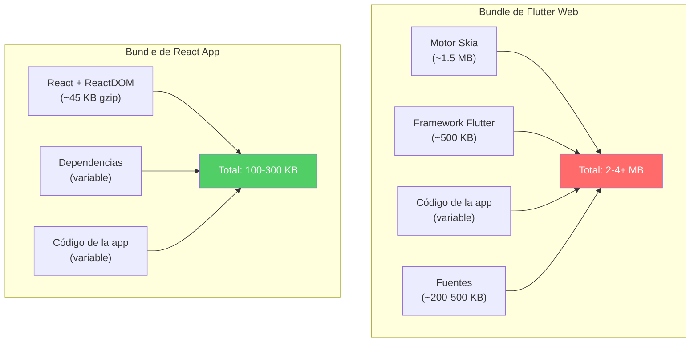

### 5. Depuración: El infierno del canvas

Las herramientas de desarrollo web que conocemos y amamos (Chrome DevTools, Firefox Developer Tools) son **prácticamente inútiles** con Flutter Web.

**Lo que pierdes:**
- ❌ Inspección del DOM
- ❌ Modificación de estilos en tiempo real
- ❌ Network throttling efectivo para debugging
- ❌ Console para debugging de componentes
- ❌ Performance profiling nativo del navegador

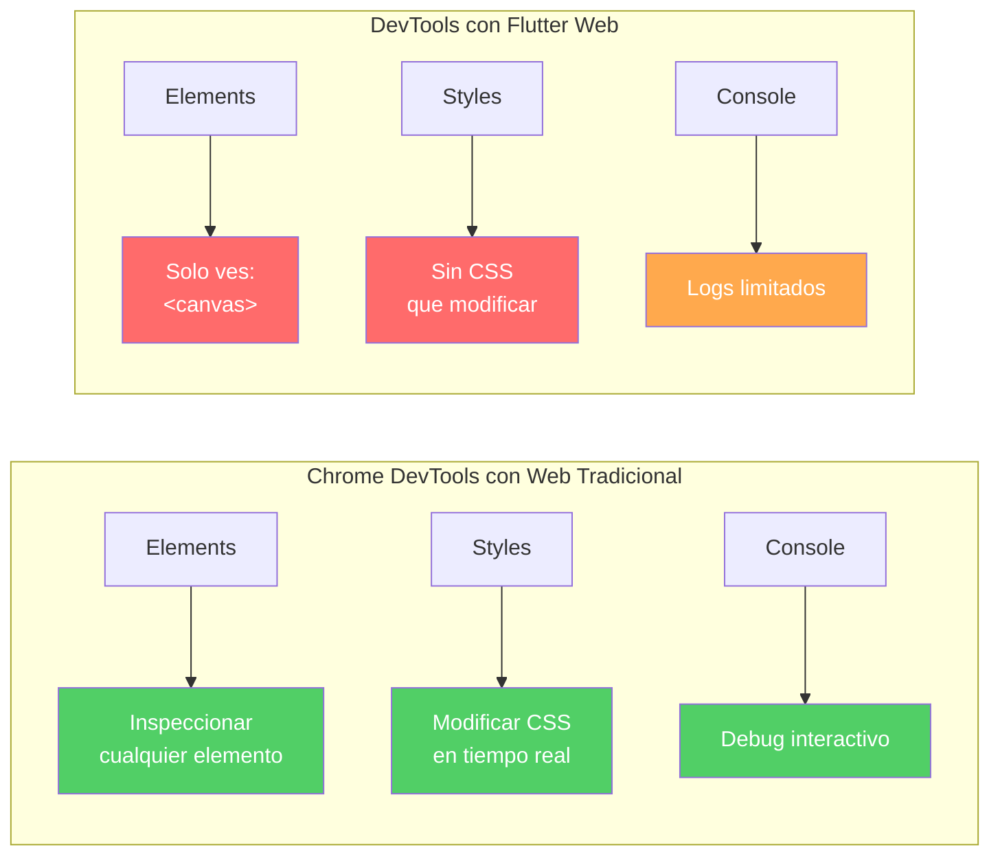

> 💡 **Nota**: Flutter tiene su propio DevTools, pero no reemplaza la experiencia de debugging web nativa que los desarrolladores frontend conocen.

### 6. Ecosistema de componentes limitado

Los frameworks web tradicionales cuentan con ecosistemas maduros de componentes UI listos para producción:

| Framework | Librerías de componentes |
|-----------|-------------------------|
| **React** | Material UI, Ant Design, Chakra UI, Radix, shadcn/ui |
| **Angular** | Angular Material, PrimeNG, NGX-Bootstrap |
| **Vue.js** | Vuetify, Quasar, Element Plus, PrimeVue |
| **Flutter Web** | Material (portado de móvil), limitadas opciones web-first |

**El problema**: Los componentes de Flutter están diseñados pensando en móvil. Elementos como:
- Tablas con scroll horizontal (vs tablas responsivas web)
- Dropdowns que no respetan el viewport
- Datepickers con UX móvil en desktop
- Formularios sin autocompletado del navegador

### 7. Responsividad: Reinventando la rueda

En la web tradicional, tenemos herramientas probadas por años de evolución:

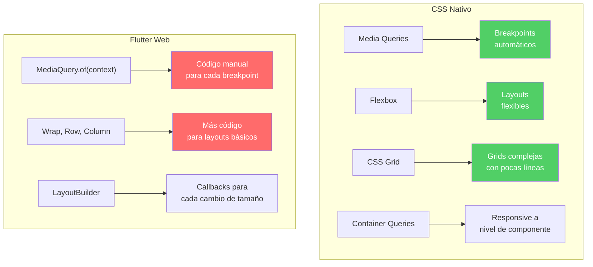

**Comparación de código para un layout responsivo simple:**

```css
/* CSS - 3 líneas */
.container {
  display: grid;
  grid-template-columns: repeat(auto-fit, minmax(300px, 1fr));
  gap: 1rem;
}
```

vs Flutter que requiere significativamente más código con LayoutBuilder, condicionales y widgets anidados.

### 8. Filosofía mobile-first llevada al extremo

Flutter fue diseñado con una mentalidad **mobile-first**, lo cual se refleja en cada aspecto del framework:

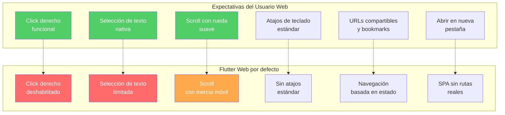

## ¿Cuándo SÍ podría considerarse Flutter Web?

Para ser justos, existen escenarios muy específicos donde Flutter Web podría tener sentido:

1. **Prototipado rápido** de una app móvil existente para demostración web
2. **Aplicaciones internas** sin requisitos de SEO ni accesibilidad estricta
3. **Juegos o visualizaciones** donde el canvas es realmente necesario
4. **Equipos 100% Flutter** sin expertise en desarrollo web

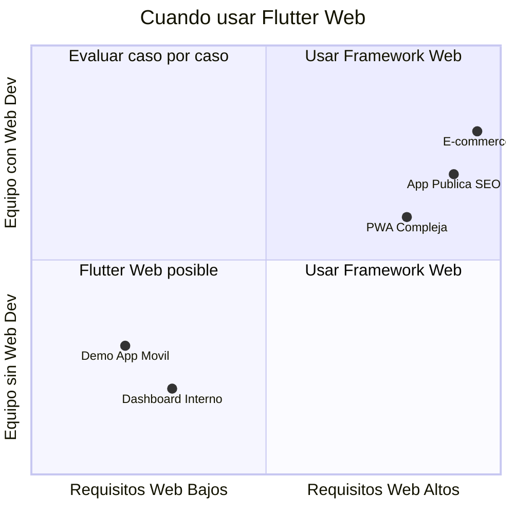

## Conclusión y recomendaciones

Basándome en mi experiencia directa y en los argumentos técnicos presentados, **no recomiendo Flutter para desarrollo web de producción** en la mayoría de los casos.

### Resumen de problemas críticos:

| Aspecto | Impacto | Severidad |
|---------|---------|-----------|
| Performance | UX degradada, usuarios frustrados | 🔴 Alto |
| Accesibilidad | Riesgo legal, exclusión de usuarios | 🔴 Crítico |
| Tamaño del bundle | SEO afectado, carga lenta | 🔴 Alto |
| Debugging | Productividad reducida | 🟠 Medio |
| Ecosistema | Más código, más tiempo | 🟠 Medio |
| Responsividad | Más complejidad | 🟠 Medio |

### Mi recomendación:

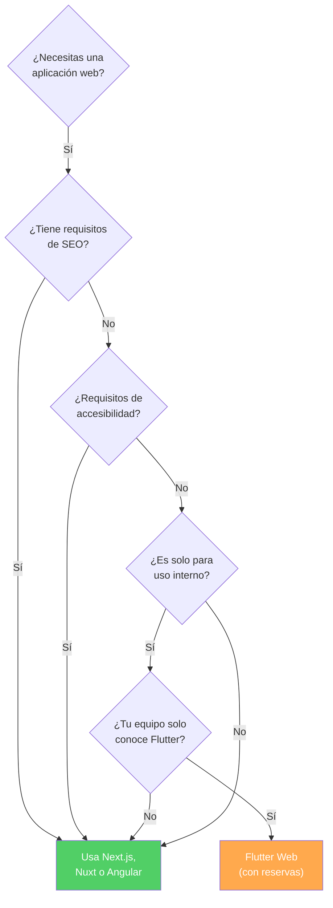

**Alternativas recomendadas:**
- **React/Next.js**: Ecosistema maduro, excelente DX, SSR/SSG
- **Angular**: Enterprise-ready, TypeScript nativo, arquitectura robusta
- **Vue.js/Nuxt**: Curva de aprendizaje suave, muy productivo
- **Svelte/SvelteKit**: Performance excepcional, sintaxis limpia

> 📌 **Mensaje final**: Flutter es una herramienta **excepcional** para desarrollo móvil. Pero intentar usarla para web es como usar un destornillador para clavar un clavo: técnicamente posible, pero hay herramientas diseñadas específicamente para ese trabajo.

---

*¿Has tenido experiencias similares con Flutter Web? ¿O quizás tu experiencia fue positiva? Me encantaría conocer tu perspectiva en los comentarios.*